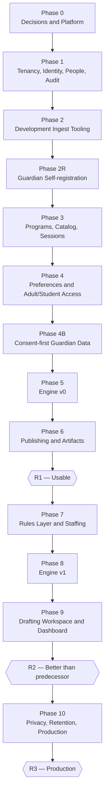

# Mini Class Planner — Delivery Plan

**Status:** Phase 0 in progress
**Source of truth for behaviour:** [`SPEC.md`](./SPEC.md). This document says *when* and *in what
order*; the spec says *what*. Where the two disagree, the spec wins and this document is wrong.
**Architecture decisions:** [`docs/adr/`](./docs/adr/)

---

## Contents

- [How this plan is structured](#how-this-plan-is-structured)
- [Current state](#current-state)
- [Foundational decisions](#foundational-decisions)
- [Release milestones](#release-milestones)
- [Phase sequence](#phase-sequence)
- [Phases in detail](#phases-in-detail)
- [Platform track summary](#platform-track-summary)
- [Standing engineering rules](#standing-engineering-rules)
- [Risk register](#risk-register)

---

## How this plan is structured

Each phase carries two tracks:

- A **feature track** — domain capability, traced to numbered spec sections.
- A **platform track** — the CI, test, agent-specification and reliability investment that phase
  needs. Platform work is deliberately distributed rather than front-loaded, so each investment is
  paid for by the phase that consumes it.

Phases 0–2 are decomposed to task level, and Phase 3 decomposition starts here. Later phases remain
scoped and sequenced but not yet decomposed; each is decomposed at the point it starts, when the
preceding phase's learnings are available. This document is expected to be revised at every phase
boundary.

Every phase lists **exit criteria**. A phase is not complete until they hold.

---

## Current state

Scaffolding is complete and a health check runs end to end.

| Area | State |
|---|---|
| Backend | Go 1.26, chi, pgx, sqlc, Goose. Config, DB pool, health handler, graceful shutdown. |
| Frontend | React 18, TypeScript, Vite, TanStack Query, React Router. Health page, app shell. |
| Database | PostgreSQL 18 in Docker Compose. One migration: `health_checks`. **No domain model.** |
| CI | Five checks: backend tests, frontend tests, frontend build, frontend lint, repo formatting. |
| Orchestration | Detent with isolated worktrees, two concurrent agents, GitHub Projects tracker. |
| Tooling | proto pins Go / Node / Bun. Air for hot reload. Smoke test script. |

The backend encodes no domain assumption. The **frontend does**: the scaffolded shell is a generic
teacher-dashboard mock with fabricated figures and placeholder routes for `/classes`,
`/assignments`, `/students` and `/settings`, and its vocabulary collides with the specification's —
*assignment* here means a student's placement in an offering (§8.6), not homework, and §6.6 has no
password-holding "teacher account" persona. Fabricated data that resembles real data is a liability
in an agent-driven repository, because it gives a plausible-looking target to build toward. It is
deleted in Phase 0.

---

## Foundational decisions

Four architectural forks were identified before Phase 1. Their resolutions are recorded as ADRs.

| ID | Decision | Resolution | ADR |
|---|---|---|---|
| D1 | Assignment solver technology | **Python OR-Tools CP-SAT sidecar.** Validation deferred to Phase 5 rather than spiked up front. | [0003](./docs/adr/0003-assignment-solver-technology.md) |
| D2 | Authentication | **Keep Supabase Auth** for administrative accounts; adult guardian access uses application-owned email OTP sessions, with step-up MFA for administration. Student survey access uses application-owned scoped codes. | [0002](./docs/adr/0002-authentication-and-access-mechanisms.md), [0013](./docs/adr/0013-guardian-and-volunteer-access.md) |
| D3 | API contract between Go and TypeScript | **Go is the source of truth**, via Huma v2 over chi. `openapi.json` committed and drift-checked; TypeScript generated at build time. | [0004](./docs/adr/0004-api-contract-and-type-generation.md) |
| D4 | Published-artifact serving topology | **Served by the main API.** §22.3's independence SHOULD is knowingly relaxed for v1, with a named revisit trigger. Publishing still materialises a snapshot. | [0005](./docs/adr/0005-published-artifact-availability.md) |

Four further decisions were taken while decomposing Phases 0 and 1, and are recorded as ADRs
rather than left implicit in the task list:

| ID | Decision | Resolution | ADR |
|---|---|---|---|
| D6 | Tenancy enforcement | **PostgreSQL row-level security, enabled and forced**, with two database roles, a closure-based tenant-scoped data layer, composite foreign keys, and a two-layer isolation harness. | [0007](./docs/adr/0007-tenancy-enforcement-and-data-access.md) |
| D7 | Authorization and audit | **Capabilities declared as operation metadata**, default-deny; audit entries written inside the mutating transaction, which cannot commit without one. | [0008](./docs/adr/0008-authorization-capabilities-and-audit.md) |
| D8 | Administrator sessions and provider | **Stay with Supabase**; local JWKS verification behind an interface with a test issuer, bearer tokens in the browser, invitation-based provisioning. Clerk evaluated and rejected. | [0009](./docs/adr/0009-administrator-sessions-and-identity-provider.md) |
| D9 | Schema and generated-code conventions | UUIDv7 keys, closed sets single-sourced, timestamped migrations, and a fixed set of committed generated artifacts that are never hand-merged. | [0010](./docs/adr/0010-schema-generated-code-and-migration-conventions.md) |

Two further decisions postdate Phase 1. They are listed separately rather than folded into the table
above, because that table records what decomposition revealed and these record what shipping
revealed — the roster work established that no source for household data exists, and that the
vocabularies the roster draws on were scoped one level too high:

| ID | Decision | Resolution | ADR |
|---|---|---|---|
| D10 | Household as a domain entity | **Household removed from the domain model.** The guardian relationship is the sole family construct; scope is derived, not stored. | [0012](./docs/adr/0012-remove-the-household-entity.md) |
| D11 | Scope of the grade and homeroom vocabularies | **Scoped to the school year, not the organization.** The organization still configures the homeroom *label*; each year defines its own value sets, entered by hand with no copy-forward. | [0015](./docs/adr/0015-year-scoped-attribute-vocabularies.md) |
| D12 | Production roster authority | **Guardians self-register through an organization/year link.** Import is retained for synthetic development testing only. Superseded for v1 by the consent-first Phase 4B retrofit below. | [0017](./docs/adr/0017-guardian-self-registration-as-production-roster-authority.md) |

The historical wide survey format is one row per adult with their children named inline, so the
adult→student edge is sourced and the adult→adult grouping into a household never was. There is no
replacement entity and renaming to `Family` was rejected: a name for an inference does not make it
sourced. ADR 0012 supersedes [0006](./docs/adr/0006-household-and-volunteer-access.md). ADR 0013
records the resulting adult access decision for Phase 4.

D10 postdates Phase 1, so it is retrofit rather than plan: Phase 1 shipped the three household
tables and they have to come back out. That lands as a **new timestamped migration** whose `Down`
recreates them exactly — never as an edit to the merged one — together with the API, frontend and
seed surfaces built on top of them. The Phase 1 bullets below describe the model as it stands after
that removal, not as it was first built.

D11 is retrofit on the same terms, and lands at the Phase 2/3 boundary because Phase 3 is the point
at which something other than `students` would start referencing these tables — offerings carry a
grade window and program membership is typically a grade range. Phase 1 shipped `grade_levels` and
`homerooms` keyed on the organization alone; they gain `school_year_id`, the `students` foreign keys
become three-column per [ADR 0007](./docs/adr/0007-tenancy-enforcement-and-data-access.md) §5, and
the closed-year trigger reaches them for the first time. The existing rows are fanned out per year
by the migration rather than reassigned or discarded, because `students.homeroom_id` is `NOT NULL`
and discarding the vocabulary would take the roster with it. The Phase 1 bullets below describe the
model after that move.

The adult access decision is resolved in [ADR 0013](./docs/adr/0013-guardian-and-volunteer-access.md) and amended by D12. Guardian OTP and preference access remain in Phase 4; the narrower accountless roster-registration principal lands in Phase 2R. The later consent and privacy requirement is captured as **Phase 4B** rather than by renumbering Phase 5 and beyond: registration now means mailbox proof or invitation redemption, year-scoped terms acceptance, guardian-owned adult/profile creation, guardian-managed students, placeholder students for unregistered children, and explicit end-of-year purge (SPEC §11, §21).

---

## Release milestones

| Milestone | Lands at | Meaning |
|---|---|---|
| **R1 — Usable** | End of Phase 6 | A real session can be run end to end: guardians consent and manage their roster data, organizers reconcile it, the catalog is authored, preferences are collected, placements are solved, and class and dismissal lists are published. Replaces the CLI pipeline and the Docs step. |
| **R2 — Better than the predecessor** | End of Phase 9 | Tags, pairings, fairness, variety, warnings, overrides, explainability and the quality dashboard. Placement quality provably beats the historical baseline; the ~200 hand-written exclusion rows per year are gone. |
| **R3 — Production** | End of Phase 10 | Privacy hardening, end-of-year purge, hard deletion, tested restore, observability. Safe to operate with real children's data and delete it deliberately at year end. |

R1 is the important cut line. Everything after it improves placement quality and organiser
ergonomics; nothing after it is required to run a Friday.

---

## Phase sequence

The dependency chain is genuinely close to linear: the solver needs preferences, preferences need a
catalog, a catalog needs a programme, and a programme needs people. `Phase 2R` and `Phase 4B` use
suffixes rather than renumbering later phases because those phase numbers are already cited by accepted
ADRs and landed work. Phase 4B is a retrofit for new consent/privacy requirements after Phase 4; Phase
5 and beyond remain structurally unchanged.

---

## Phases in detail

### Phase 0 — Decisions and platform foundation

*No domain code. Make the repository safe for sustained agent throughput before volume begins.*

The motivation is specific: Detent runs up to two agents concurrently with `approval_policy: never`,
and the merge gate is currently `run: "true"` with no required status checks. Agents self-report
green. Before the domain model arrives, the gate must be real.

**Feature track:** none.

**Platform track**

- Resolve **D3** and **D4**; record **D6–D9** as accepted ADRs.
- Adopt ADRs as the architecture record. Retire the point-in-time narrative docs.
- **Nine CI checks**, replacing today's five. New: `Backend lint` (`golangci-lint`, carrying the
  `depguard` import restrictions that make the tenancy guard unbypassable), `Backend format`
  (`gofmt -l` plus `go vet`), `Generated code drift` (one check folding `sqlc`, `go generate` and
  `openapi.json` regeneration), and `Migration round-trip` (up→down→up). `Backend tests` gains
  `-race`.
- Two database roles — `miniclass_migrator` and `miniclass_app` — in Compose init and CI, and
  timestamped Goose migrations replacing sequential numbering.
- Wire `detent.yaml` `gate.required_status_checks` to the nine check names and replace the
  `run: "true"` no-op.
- Adopt **Huma v2** over chi: health endpoint ported, RFC 9457 error shape, `cmd/openapi` generator,
  `openapi.json` committed and drift-checked, `openapi-typescript` + `openapi-fetch` on the frontend
  replacing the hand-written client.
- **Delete the mock frontend shell**; adopt **Tailwind v4** (via `@tailwindcss/vite`) and shadcn/ui at
  a deliberately narrow scope — the `@/*` path alias, three primitives, health page ported,
  `index.css` removed. Doing this before Phase 1 keeps the first agent to touch UI from making every
  foundational decision inside a PR about students.
- Clean the leftover placeholder preamble out of `WORKFLOW.md` and rewrite its gate table.
- Add a PR template requiring a spec citation, and `CODEOWNERS`.
- Extend `AGENTS.md` with the standing rules in
  [Standing engineering rules](#standing-engineering-rules), under one filter: **a rule that CI
  enforces is stated in one line naming its check; a rule nothing enforces needs a good reason to be
  a rule.**

**Exit criteria**

- Every CI check is enumerated in `detent.yaml` and blocks the Detent gate.
- A deliberately broken `gofmt`, `sqlc` drift, or down-migration fails CI — demonstrated once, with
  recorded evidence.
- ADRs 0001–0005 and 0007–0010 are accepted, and the phase's one deliberately open question is
  written down as an ADR rather than left implicit in a task list — 0006 when the phase closed, 0013
  now that 0012 has superseded it.
- The repository contains no document that describes the project as "scaffolding, implementation
  needed", and no screen that displays invented data.

---

### Phase 1 — Tenancy, identity, people, audit

*SPEC §8.1–8.2, §8.7, §9, §20.1. The spine.*

This phase's centre of gravity is the **tenancy guard**, not the CRUD. SPEC §9.1 explicitly rejects
retrofitting tenancy, and §9.2 states that a tenant-scoped entity added without an isolation test
*is a defect*. Getting the guard and its test harness right here is what makes every later phase
cheap.

**Feature track**

- Organisation → School Year → Student / Adult / GuardianRelationship, with row-level
  `organization_id` on every entity below Organisation. (Household was originally built here and is
  removed by D10.)
- The tenancy guard: central and **default-deny**. A query issued without tenant context must
  **fail**, not return unscoped rows. Applies to reads, writes, aggregates and reports.
- Administrator authentication (Supabase Auth per ADRs 0002 and 0009) with invitation-based
  provisioning, and the `Owner` / `Administrator` / `Coordinator` roles expressed as **capabilities
  declared per operation**, default-deny. Tenant check precedes permission check; cross-tenant
  requests return **not-found, not forbidden** (§9.4).
- Append-only audit log, written inside the mutating transaction. A read-write transaction that
  records no entry does not commit.
- Manual CRUD for every person and every guardian relationship. After D12 this is an audited review,
  correction and reconciliation surface, not an alternative production bulk-load workflow (§11.2,
  §11.6).
- **Grade and homeroom vocabularies** (§10.1), moved here from Phase 2. Structured vocabularies avoid
  the defect §10.1 forbids — ordering taken from the string, so grade `10` sorts before grade `9`.
  Both are **scoped to the school year** (D11): a new year starts with empty vocabularies and nothing
  is copied forward. D12 required grades before registration opened and permitted homeroom assignment
  afterward; Phase 4B tightens the parent-facing v1 forms to require both grade and homeroom/classroom.
  Entries are retirable rather than deletable, for the homeroom that stops being used partway through a
  year while that year's students still reference it.
- School-year lifecycle: `Setup` / `Active` / `Closed`, with two years permitted `Active` at once.
  `Closed` immutability is enforced by a shared database trigger on every year-scoped table, so the
  refusal is loud and explanatory (409) rather than a silent zero-row update. `Closed → Active` is
  permitted, Owner-only, reason required, audited — the §3.3 defect was *unattributable* mutation,
  not mutation.

**Things that are easy to get wrong here**

- A student **may have more than one guardian** (§8.2). Separated families are explicitly not an
  edge case; the wide import format in Phase 2 expresses them as two adults' rows, because each row
  carries the authority of its own adult only. There is no entity above the relationship: the set of
  students an adult can act for is derived from their guardian edges at read time, never stored
  (D10).
- Adult *role* is a property of assignment, not of the person (§8.2).
- Preferred given name is displayed in preference to legal name **everywhere** (§8.2).
- Identifiers are opaque and system-generated; **names are never keys** (§8.7). The predecessor
  joined on typed full names and lost a whole session's data to a two-word surname (A.5 defect 4–5).
- Cross-year student identity is absent in v1 (§8.7). Any prior-year link built before the Phase 4B
  decision is deprecated and must not become load-bearing.

**Platform track**

- The reusable **cross-tenant isolation test harness**, in two layers. *Layer 1* is generic and needs
  no per-table work at all: it walks the catalog and asserts, for every table the application role can
  touch, that it is allowlisted or tenant-scoped, that row-level security is enabled **and forced**,
  that a policy exists, that composite foreign keys carry `organization_id`, and that a query with no
  tenant context fails rather than returning nothing. *Layer 2* is one registry line per entity — a
  factory and a fetch-by-id — from which cross-tenant read, write, delete and not-found cases are
  generated. Layer 1 also fails if a tenant-scoped table has no Layer 2 entry, which is what makes the
  §9.2 rule mechanical rather than aspirational.
- Test data factories. Tests isolate by **organisation, not by schema**, which is faster,
  parallel-safe, and dogfoods the guard.
- A seed corpus sized from SPEC Appendix B.1: 139 students in the recorded grade distribution
  (20/27/22/21/30/19), six homerooms, ~100 adults with the recorded participation split, generated
  deterministically with synthetic names. It deliberately includes the awkward cases the schema can
  hold — students with two guardians, students with none, adults who are guardians of students in
  more than one family, and a two-word surname, which is the shape that silently cost the
  predecessor a session (A.5 defects 4–5).
  **Never load a real roster into a development or test database.**

**Exit criteria**

- An administrator can sign in, create a school year, configure its vocabularies, and correct people
  and guardian relationships through audited administrative tools.
- Every tenant-scoped table has an isolation test; a new table without one fails **CI**, not review.
- Deleting the tenant context from any repository call fails a test rather than leaking rows.
- Every mutation appears in the audit log with actor, timestamp, object and change summary.
- An operation registered without a declared capability fails a test.

---

### Phase 2 — Development ingest tooling

*Current SPEC §11.7. [ADR 0014](./docs/adr/0014-roster-ingest-scope-and-source-authority.md)
records the implemented importer contract; [ADR 0017](./docs/adr/0017-guardian-self-registration-as-production-roster-authority.md)
supersedes it as production roster authority.*

**Development-tooling track**

This phase no longer delivers a production feature. Its importer MUST be absent from production API
operation enumeration, commands, configuration and administrator capabilities. It remains useful for
synthetic fixtures and data-layer testing.

- Two source kinds: `roster_json`, the historical community-platform wide export, and
  `grades_csv`, a two-column student-name/grade file. Parsers translate to the historical canonical
  shape and resolve fields **by name or explicit mapping, never by position** (ADR 0014).
- The wide format's development-fixture authority is **the adult on the row, not the student**: it
  sets exactly that adult's guardian edges and never touches an edge owned by another adult. Two
  adults' rows compose into a two-guardian student, and the preview lists removed edges (ADR 0014).
- Matching is by external identifier only for these retained development parsers. These rules do not
  apply to production self-registration matching (§11.5).
- The historical enrolment and adult filters, nullable grade, non-parsed classroom labels, and
  exclusion reporting remain fixed in ADR 0014 for parser-test compatibility only.
- Two-phase preview → atomic commit is stateless and content-hash guarded, with per-row `Create` /
  `Update` / `Unchanged` / `Conflict` / `Error`. `Conflict` rows are reported and skipped for fixture
  correction and re-import (ADR 0014).
- **Development-import idempotency** — re-importing an unchanged synthetic source produces zero
  changes and reports every row `Unchanged`.

**Platform track**

- Synthetic golden-file fixtures cover both source kinds. Real roster data is never loaded into
  development or test databases, and no operator demonstration imports a production roster.
- A property test asserting import idempotency across arbitrary re-import orderings.

**Exit criteria**

- Synthetic fixtures for both source kinds parse and import cleanly, and importing each unchanged
  source a second time reports every row `Unchanged`.
- Production builds expose no importer endpoint, command, configuration or capability.
- Synthetic conformance fixtures exercise both parsers without using real people.
- A deliberately ambiguous or otherwise unresolved row is reported for manual correction; the
  retained development parser does not attempt name-based matching (ADR 0014).

---

### Phase 2R — Guardian self-registration

*SPEC §6.2, §8.2, §9.3–§9.4, §11, §20.1, §21;
[ADR 0017](./docs/adr/0017-guardian-self-registration-as-production-roster-authority.md). The suffix
preserves existing phase references while inserting the new production roster authority before
programme delivery.*

**Feature track**

This phase describes the registration model that had landed before the consent-first change. Phase 4B
supersedes it for v1 behaviour while preserving the useful implementation pieces: tenant/year link
lifecycle, rate limiting, provenance, matching tests and reconciliation.

- Registration-window lifecycle and one high-entropy, hashed, expiring, revocable and regenerable
  link bound to one organization and school year.
- A registration-only principal that can submit data and receive minimal match confirmation, but
  cannot list or retrieve the roster or enter guardian, preference, placement or administration
  surfaces.
- A mobile, accountless form for adult given/family name, optional email, and zero or more children
  with given/family name and grade.
- Exact child matching on normalized name plus grade. One candidate requires explicit yes/no
  confirmation with no additional disclosure; no match creates; rejection or ambiguity creates a
  provisional record and review item. Fuzzy matching warns but never attaches.
- Atomic submission provenance covering access channel, adult input, each match outcome, created
  people and guardian edges. A second adult can independently confirm the same child without seeing
  the first adult.
- Organizer review for rejected and ambiguous matches, likely duplicates, missing homerooms, missing
  or duplicate email, repeated child claims and unusual volume.
- Audited duplicate reconciliation that preserves both submissions and moves relationships and
  dependents by opaque identifier. Names are never keys.
- Temporarily nullable student homeroom after registration, with explicit completeness gating before
  operational programme membership or dismissal publication.
- Rate limiting, link-abuse monitoring and optional low-friction anti-automation challenge.
- Known-email invitation data model as an extension seam only. Phase 4B narrows this to invitation
  contact metadata and single-use link export, still with automated delivery and reminders deferred.

**Task breakdown**

The task citations in this completed phase reflect the pre-Phase-4B §11 contract and ADR 0017. Use
Phase 4B for current v1 registration and consent behaviour.

| Task | Scope | Spec/ADR | Effort |
|---|---|---|---|
| **P2R-1 — Registration security contract** | Registration principal, tenant/year token scope, lifecycle, hashing, revocation/regeneration, rate limits, minimal-disclosure and production-import denial tests. | §9.3–§9.4, §11.2–§11.3, §11.7, ADR 0017 | xhigh |
| **P2R-2 — Registration and provenance model** | Windows, submissions, per-child outcomes, relationship source/provenance, access channel, and audit integration; every new tenant table gets registry and isolation coverage. | §8.2, §11.6, §20.1, §9.2 | xhigh |
| **P2R-3 — Adult and child registration flow** | Mobile form, optional email, grade vocabulary, exact matching, confirmation, create/reject/ambiguous outcomes, atomic completion. | §11.4–§11.6, §22.4 | xhigh |
| **P2R-4 — Incomplete roster support** | Nullable homeroom transition, visible completeness state, and programme-membership/dismissal guards with migration and regression coverage. | §8.2, §10.1, §11.6, ADR 0017 | xhigh |
| **P2R-5 — Review and reconciliation** | Duplicate and repeated-claim queues; audited merge/move preserving relationships, dependents and original submissions; correction UI. | §5.4, §11.6, §20.1 | xhigh |
| **P2R-6 — Integration, accessibility and abuse tests** | Mobile end-to-end flow, two-adult shared-child case, token boundary, no-disclosure assertions, concurrency, rate limiting and production-import absence. | §9.2–§9.4, §11, §21, §22.4–§22.5 | xhigh |

**Recommended dependency order**

`P2R-1 → P2R-2 → P2R-3 → P2R-4 → P2R-5 → P2R-6`

`P2R-4` may proceed beside `P2R-3` after the provenance model fixes the creation contract.

**Exit criteria**

- An adult with no account can use the common link on a phone to register themselves and children,
  including omitting email, without seeing roster data.
- Two adults can independently register the same exact child and produce two guardian edges to one
  opaque student without learning about each other.
- Rejected and ambiguous matches create reviewable provisional records and never alter an existing
  child silently.
- An organizer can reconcile duplicates without losing relationships, dependent data or either
  submission's provenance; the action is audited.
- Closed, expired, revoked, cross-tenant and cross-year registration attempts fail, and automated
  tests prove match confirmation reveals no additional child data.
- Production exposes no roster-import path, while synthetic development-import tests continue to pass.

---

### Phase 3 — Programmes, catalog, sessions, lifecycle

*SPEC §12, §14, §8.3–8.5.*

**Feature track**

- Programme with **explicit** membership (grade rules may populate it; the stored fact is the list),
  its own interest-area vocabulary, tag definitions and objective weights.
- Interest areas with **stable identity separate from display label** (§12.3). Appendix B.4 shows
  label churn silently corrupting variety history — `Knitting Club` tagged `knitting` in some
  sessions and `fabric_arts` in others.
- Session ordered by its first meeting date, with real meeting dates. The
  predecessor stored no dates at all, which is why years of availability data were unusable.
- Class offerings: name, description, capacity, grade window, minimum viable enrolment, location,
  meeting point, meeting instructions, optional interest area. A grade window references the **school
  year's** grade vocabulary (D11), so its bounds carry the year like every other reference between
  year-scoped entities ([ADR 0007](./docs/adr/0007-tenancy-enforcement-and-data-access.md) §5).
- The seven-state session lifecycle as a real state machine, with the gates in §14.4.
- Backward transitions that warn, state what they invalidate, mark draft assignments stale rather
  than discarding them, and are audit-logged (§14.5).
- Session non-participation as a first-class record **with a reason** (§8.3), never expressed by
  removing the student from the programme.
- The five non-blocking catalog feasibility warnings (§14.2).

**Note on `Complete`.** Entering `Complete` is the transition that commits placements to programme
history, and it is what later feeds fairness (§17.5) and variety (§17.6). Its semantics must be
right in this phase even though nothing consumes them until Phase 8.

**Task breakdown (start)**

The first slice landed at the Phase 2/3 boundary: programme and explicit membership, including the
known-grade gate and missing-grade flagging.

| Task | Scope | Spec | Effort |
|---|---|---|---|
| **P3-1 — Programme core and explicit membership** *(landed)* | Programme create/list, explicit membership add/remove/list, missing-grade summary, tenancy/audit coverage. | §8.3, §12.1, §10.1, §20.1 | high |
| **P3-2 — Interest-area vocabulary for programmes** | Per-programme managed vocabulary with ordered display, stable identity vs mutable label, retirement semantics preserving history. | §12.1, §12.3, §12.4 | high |
| **P3-3 — Session entity and meeting dates** | Session model ordered by first meeting date and one-or-more meeting dates; schema constraints for year/programme scope. | §8.5, §14.1 | high |
| **P3-4 — Offerings model and CRUD** | Offering create/edit/list/delete with name, description, capacity, grade window, minimum viable enrolment, location, meeting point/instructions, optional interest area. | §8.4, §12.4, §14.2 | high |
| **P3-5 — Session lifecycle state machine** | Seven-state lifecycle with legal transitions only, gates from §14.4, transition audit entries, and backward-transition invalidation summaries with stale-draft marking (no discard). | §14.3, §14.4, §14.5, §20.1 | xhigh |
| **P3-6 — Session non-participation records** | First-class per-session non-participation with required reason; never encoded as programme-membership removal. | §8.3, §5.2 | high |
| **P3-7 — Catalog feasibility warnings** | Non-blocking checks: aggregate capacity, grade coverage, minimum viability, area coverage, unmatched offerings. Exposed in authoring surface and APIs as warnings only. | §14.2, §5.2 | xhigh |
| **P3-8 — Objective defaults surface** | Programme-level objective weights with session override surface and persistence; wiring only (consumed by solve phases later). | §12.1, §14.1, §17.7 | high |
| **P3-9 — Frontend and integration consolidation** | Programmes/sessions/catalog authoring UI flows, generated client wiring, and integration/e2e coverage for key happy paths and refusal semantics. | §12, §14, §22.4 | high |

**Recommended dependency order**

`P3-2 → P3-3 → P3-4 → P3-5 → P3-6 → P3-7 → P3-8 → P3-9`

`P3-6` may start once `P3-3` exists. `P3-9` should be split where possible to follow backend seams
rather than landing as one large frontend bundle.

**Platform track**

- Table-driven state-machine tests covering every legal transition and rejecting every illegal one.

**Exit criteria**

- A full eight-session programme with real meeting dates can be authored.
- No illegal state combination is representable in the schema.

---

### Phase 4 — Preferences and adult/student access

*SPEC §13, §19.5; [ADR 0013](./docs/adr/0013-guardian-and-volunteer-access.md). Preference
history import is intentionally out of scope; all preference data is collected natively.*

**Feature track**

- Interest profiles scoped to student + program, with retained submissions and per-area effective
  overlay semantics. The latest valid rating for each area wins; omitted areas are not cleared.
- Interest-profile surveys as separate entities from the vocabulary: ordered area subsets, configurable
  audience, configurable response window, and Draft/Open/Closed lifecycle. Opening freezes audience,
  questions, scale version, and student codes; deadlines close access automatically; reopening warns and
  is audited.
- Ranked choices per session, with unique ranks enforced at entry, retained submissions, and latest-valid-
  complete-response replacement. Access opens with the session voting window and closes automatically at
  its deadline before assignment.
- Student access codes: high-entropy, hashed, regenerable, revocable, and unique to one student and one
  survey/session. Organizer-only code list grouped by homeroom, with print-friendly presentation; no
  automated distribution in this phase.
- Unified adult identity: email OTP creates guardian access; linked administrators step up with mandatory
  MFA. Guardian mode shows only current guardian-scoped students; administration is a separate mode and
  requires reauthentication after survey mode. Explicit account-to-adult links and duplicate-email
  safeguards are required.
- Administrator-on-behalf entry for students without guardians, without email, or otherwise needing
  assistance; every record remains bound to a student and records actor/channel/time.
- Ranked-choice and interest-profile response rules, including guardian/student resubmission precedence,
  Rated/Unrated/No response distinctions, and server-side authorization.
- Student-centric response tracking with totals and percentages by grade/homeroom, named non-responders,
  unreachable students, and a separate outstanding-students-by-guardian view.
- Transactional email for adult OTP only. Parent emailing of student codes, reminders, and other bulk or
  workflow notifications remain deferred. Volunteer sign-up and availability remain in Konstella;
  staffing data is organizer-managed.

**Task breakdown**

| Task | Scope | Spec/ADR | Effort |
|---|---|---|---|
| **P4-0 — Access decision and security contract** | Update principal/capability model; explicit account-to-adult links; OTP/session assurance levels; mandatory admin MFA, recovery, revocation, duplicate-email and no-email behavior. | §6.2, §6.5–6.6, §9.3–9.4, §13.8, ADR 0013 | high |
| **P4-1 — Preference data model and effective values** | Interest-profile submissions, per-area overlay, ranked-choice submissions, valid-response replacement, actor/channel attribution, and program/session scoping. | §8.3, §13.1–13.5, §13.7 | high |
| **P4-2 — Interest-profile surveys** | Survey CRUD, audience filters, scale snapshot, open/close deadlines, frozen definition, auto-close, reopen warning/audit, code issuance, and retention. | §13.5–13.6 | xhigh |
| **P4-3 — Ranked-choice response window** | Session voting configuration, per-student/session codes, unique-rank validation, response replacement, deadline enforcement, and lifecycle integration. | §13.3, §14.1, §14.3–14.5 | xhigh |
| **P4-4 — Adult OTP and unified modes** | Transactional OTP delivery, bounded sessions, current guardian scope, linked admin identity, step-up MFA, recovery, privacy-mode navigation, and reauthentication. | §6.2, §6.6, §9.3–9.4, §13.8, §22.5, ADR 0013 | xhigh |
| **P4-5 — Student code distribution** | Organizer-only code list scoped by survey/session, grouped by homeroom, print-friendly, regeneration/revocation, and no bulk email. | §13.8, §19.5, §22.4 | high |
| **P4-6 — Submission surfaces** | Mobile guardian flow for all guardian-scoped students; student-code flow for one student; administrator-on-behalf flow; resubmission and actor attribution. | §6.2, §6.5, §13.7–13.8, §22.4 | xhigh |
| **P4-7 — Response tracking and follow-up views** | Student-level denominator and percentages; grade/homeroom breakdowns; unreachable/no-email states; separate guardian outstanding list. | §19.5 | high |
| **P4-8 — Integration, accessibility, and security tests** | Tenant isolation and authorization tests; OTP/MFA and code lifecycle tests; lifecycle table tests; mobile Playwright coverage; accessibility CI baseline; generated API client wiring. | §5.2, §9.2–9.4, §13, §14.3, §19.5, §22.4 | xhigh |

**Recommended dependency order**

`P4-0 → P4-1 → P4-2 → P4-3 → P4-4 → P4-5 → P4-6 → P4-7 → P4-8`

`P4-2` and `P4-3` may proceed in parallel after `P4-1` where their API boundaries are separate.
`P4-4` should establish the principal/session contract before submission surfaces are built.

**Platform track**

- Playwright end-to-end coverage of guardian and student submission at a mobile viewport.
- Accessibility baseline in CI.
- Security-focused tests for tenant ordering, scope derivation, OTP/MFA assurance, code isolation,
  regeneration, revocation, and duplicate-email handling.

**Exit criteria**

- A guardian can use email OTP and submit or revise responses for every guardian-scoped student on a
  phone in one sitting, producing per-student records.
- A student can use a survey/session-specific code to submit and revise only their own response while the
  relevant instrument is open.
- An administrator who is also a guardian can enter guardian mode easily, and administration requires
  step-up MFA after leaving survey mode.
- An administrator can open a form for a selected student and submit on the student's behalf.
- Administrators can view and print student codes grouped by homeroom; no automated code email is sent.
- A report provides accurate student-level completion totals and percentages, names every non-responder,
  identifies unreachable/no-email cases, and provides a separate outstanding-students-by-guardian view.
- No preference import is implemented; a program with no placement history starts normally and reports
  fairness/variety history as unavailable until native completed sessions accumulate.

**Phase 4 validation record:** The backend integration suite covers tenant isolation, authorization,
OTP/MFA and access-code lifecycle boundaries, lifecycle windows, attribution, and student-centric
tracking. The frontend test suite covers the generated API wrappers, mobile guardian/student
submission flows, and the accessibility baseline at `frontend/e2e/accessibility.spec.ts`.

---

### Phase 4B — Consent-first guardian data management

*SPEC §5.6, §8.2, §8.7, §9.3–§9.4, §10.1, §11, §18.2, §20.1, §21. Inserted after Phase 4 because
implementation had reached that point before the consent/privacy requirement changed. Phase 5 is
independent of this retrofit once the roster and access contracts are stable.*

**Feature track**

- Replace link-authorized roster submission with consent-first onboarding: shared org/year entry link
  has no write authority; guardian proves mailbox control by OTP or single-use invitation, accepts
  year-scoped terms/privacy, then creates or confirms their own adult record.
- Add invitation email import as a narrow production bulk exception for contact metadata only. It
  creates no adult, student or guardian records before redemption; automated delivery and reminders
  remain deferred.
- Guardian student management: add students with required grade and homeroom/classroom, choose among
  minimal-disclosure potential matches, edit shared student fields, detach, delete/de-identify, and
  delete the guardian's own adult profile with confirmation prompts but no fresh OTP step-up.
- Deletion boundaries: guardian/admin correction hard-deletes only when no other guardians and no
  associated data; otherwise it removes guardian links, marks the student deleted, overwrites names and
  preferred name, retains grade/homeroom for history, excludes future use, and regenerates affected
  artifacts without revoking links.
- Administrative individual correction remains available with explicit authority and audit. Add
  placeholder students for unregistered children so organizers can produce correct class counts and
  placements without entering full identifying data, plus audited placeholder reconciliation when a
  guardian later registers the child.
- Deprecate prior-year links and cross-year copy. Each year is independent and disposable.
- Add Owner-triggered end-of-year purge: `Closed` years can become `Purged`, deleting all personal and
  operational year data while retaining only a non-identifying shell.

**Task breakdown**

| Task | Scope | Spec | Effort |
|---|---|---|---|
| **P4B-1 — Consent and invitation contract** | Registration entry semantics, OTP/invitation proofs, year-scoped terms acceptance, invitation contact import/export, token lifecycle, no-records-before-redemption tests. | §9.3–§9.4, §11.2–§11.4, §21.5 | xhigh |
| **P4B-2 — Guardian-managed student records** | Required grade + homeroom forms, minimal-disclosure candidate search, immediate selected-student access, guardian edits to names/grade/homeroom, stale warnings. | §8.2, §10.1, §11.5–§11.6 | xhigh |
| **P4B-3 — Guardian detach/delete and adult self-delete** | Relationship detach, student hard-vs-de-identifying delete, adult profile deletion, session/OTP revocation, confirmation prompts, no cross-guardian notification. | §11.6, §21.3 | xhigh |
| **P4B-4 — Admin correction and placeholders** | Admin-on-behalf authority reasons, placeholder creation, placeholder exclusion from guardian match, audited placeholder-to-student reconciliation and artifact regeneration. | §11.7, §18.2, §20.1 | xhigh |
| **P4B-5 — Purge and cross-year deprecation** | Remove/deprecate prior-year links, add `Purged` year state/shell, Owner purge command/UI, delete year-scoped data and share links. | §5.6, §8.7, §11.1, §21.4 | xhigh |
| **P4B-6 — Integration, privacy and regression tests** | Tenant isolation for new tables, consent-before-write, invitation acceptance through OTP, match disclosure, deletion/de-identification, artifact regeneration, purge completeness. | §9.2, §11, §18.2, §21 | xhigh |

**Recommended dependency order**

`P4B-1 → P4B-2 → P4B-3 → P4B-4 → P4B-5 → P4B-6`

`P4B-4` can start once the student state model from `P4B-2` exists. `P4B-5` can proceed in parallel
after the prior-year-link deprecation decision is explicit in schema/API work.

**Exit criteria**

- No guardian or student production record is created before mailbox proof and year-scoped terms
  acceptance, except audited admin-on-behalf corrections and placeholder students.
- A guardian can add, edit, detach and delete/de-identify their own students using required grade and
  homeroom/classroom fields, without seeing other guardians' data.
- Invitation email import creates contact metadata only; redeeming an invitation or completing OTP for
  an invited email marks the invitation accepted.
- Placeholder students can be assigned and published with abbreviated labels, are hidden from guardian
  matching, and can be reconciled to a later consented student by audit-preserving admin action.
- Deleting/de-identifying a student regenerates affected artifacts so stable links no longer serve the
  old name.
- A closed year can be purged to a non-identifying shell, and tests prove year-scoped personal and
  operational data is gone.

---

### Phase 5 — Engine v0

*SPEC §17.1–17.4, §17.8, §17.9 (pins only), §20.2. Narrow in rules, complete in structure.*

The rule set here is deliberately minimal — capacity, grade window, pins — but every **structural**
property is built from the first line, because determinism (§17.8) gates incremental re-solve, draft
comparison and every reproducibility claim the system makes. §17.8 calls determinism load-bearing;
it is not a hardening pass.

**Feature track**

- The Python CP-SAT sidecar and its versioned solve request/response contract (ADR 0003).
- The placement quality scale — Top / High / Acceptable / Neutral / Unwanted — mapping both
  preference models onto one ordered scale, with `Neutral` ranking above `Unwanted`.
- The **lexicographic, worst-outcome-first** objective: minimise `Unwanted`, then `Neutral`, then
  `Acceptable`, then `High`. Maximising `Top` is emergent and never stated.
- Seeded determinism, explicit stable tie-breaking (never insertion, hash or file order), and time
  limits expressed in **deterministic units** rather than wall-clock.
- Pins as **fixed decision variables, not post-processing**. This is the direct fix for the
  predecessor's silent bypass of capacity, grade window and exclusions (A.5 defect 6). Impossible
  pins are reported, never dropped.
- Immutable solve runs recording seed, effective weights, **input fingerprint**, pins, full result
  and solver status (§20.2).
- Realized preference quality **stored on the assignment** at solve time, never recomputed (§8.6).

**Platform track — the most valuable test asset in the project**

- A **historical replay harness**: run the engine against the eight real sessions in Appendix B.2 and
  assert it beats the recorded baseline. The number to beat is **43 placements against an explicit
  non-preference across the year**.
- A determinism test: same inputs and seed, byte-identical result, run repeatedly.
- A CI performance budget: full solve under 10 s, re-solve under 2 s at expected scale (§22.2).

**Exit criteria**

- A session solves, producing one assignment per participating student.
- Re-running a recorded run with its seed reproduces it exactly, and the system says so explicitly
  when the input fingerprint no longer matches.
- The replay harness beats the historical baseline on every session.

---

### Phase 6 — Publishing and artifacts → **R1**

*SPEC §18, §22.3.*

**Feature track**

- Publish semantics: a point-in-time **snapshot**, not a live view. The only blocking precondition is
  that no participating student is unplaced (§18.2). Warnings never block; staffing never blocks.
- Class list and homeroom dismissal list. Both are `[Built]` in the CLI pipeline and are the
  lowest-risk artifacts to port. **Adult email addresses must not appear** — the predecessor's
  template published them on an open URL.
- Unplaced-student reporting **by name with per-offering reasons**, and **no synthetic catch-all
  offering**. The predecessor's `Fallback` class (capacity 999, unbounded grades) was invisible in
  every published document (A.5 defect 12).
- Share-link lifecycle: one link per artifact per session, expiring, regenerable, revocable,
  high-entropy, encoding no identifiers, not indexable. Expired links fail cleanly with an
  explanation.
- Guardian placement view (authenticated, not published).
- Print stylesheets. No downloadable documents are required.
- The independently-servable topology from D4 / ADR 0005. §22.3 carves out a hard exception for
  published pages: the dismissal list is consulted at 12:45 on a Friday with children waiting, and
  must remain available when the administrative application is degraded.

**Platform track**

- Snapshot and print-rendering tests.
- Preview deployments.

**Exit criteria — R1**

- A complete session runs end to end and the dismissal list is usable on paper.
- Published pages serve with the administrative API stopped.
- No published surface contains an adult email address, a tag, a tag note or a comment.

---

### Phase 7 — Rules layer and staffing

*SPEC §10, §15, §16.2–16.3.*

These two subjects are grouped because adult pairings resolve through staffing assignments (§10.7),
and because both are inputs the engine consumes in Phase 8. Staffing could have landed earlier;
it is here because §15.1 makes it advisory and non-blocking, so nothing before this needed it.

**Feature track**

- Tags defined per programme, assignable to students, referenced by offerings. Managed in-app,
  **never inferred from imported column headers** (§10.2).
- The four dispositions: `requires` / `excludes` are solver-hard and human-overridable;
  `prefers` / `discourages` are soft.
- Tag notes — the actionable human detail behind the machine-readable boolean.
- **Sensitivity levels implemented in the data model even though v1 renders none of it publicly**
  (§10.5, §18.5). The levels exist now so that closing the known limitation in §24.4 is later a
  display change with no migration.
- Pairings between any two people, symmetric, programme-scoped, optionally session-narrowed, with an
  **active period**. These replace sibling co-placement, keep-apart rules, and the largest category
  of manual pinning — roughly 200 hand-written exclusion rows a year.
- Authoring-time conflict detection that **names the specific rules in conflict** and never
  auto-resolves (§10.8).
- Staffing: organizer-managed staffing assignments with role and note, and optional per-meeting-date
  confirmations. Volunteer sign-up and availability remain external to this system.
- Staffing remains advisory throughout: **no under-staffing warnings, no publication gate**, and an
  unresolvable adult pairing is an informational note rather than a warning (§10.7, §15.1).

**Platform track**

- A central sensitivity-enforcement mechanism, plus a surface-enumerating test that asserts no leak
  through any response, export or print path. §21.5 names an export path bypassing sensitivity as
  the single most probable regression in the system.

**Exit criteria**

- Contradictory rule sets are reported at authoring time, naming the rules.
- No surface renders content above its principal's sensitivity ceiling, proven by an enumerating
  test rather than by inspection.

---

### Phase 8 — Engine v1

*SPEC §16.4–16.7, §17.5–17.7, §17.10–17.13.*

**Feature track**

- Tag and pairing constraints in the model, hard and soft.
- **Fairness deficit**: per student, per programme, within year, accruing when a session enters
  `Complete`. Non-participation contributes nothing. This is what makes "the same child was
  disappointed three times" visible — the gap the 43-placement figure could never distinguish.
- **Variety**: separately weighted same-offering and same-interest-area penalties.
- The full soft-term set and tunable weights, defaulting on the programme and overridable per
  session, visible before solve and recorded on the run.
- The eighteen-identifier warning catalogue. Warnings are never dismissible, suppressible or
  snoozable, and are acknowledged by comment without being cleared.
- Override records bound to one specific placement, **discarded and re-evaluated from scratch when
  the placement changes**, with a prompted but not mandatory reason.
- Infeasibility diagnosis returning a minimal conflicting subset in organiser vocabulary — never a
  bare "infeasible", and never an automatic relaxation of a hard rule.
- Per-placement explainability: expressed preference, resulting quality, fairness weight, and every
  offering the student would have preferred **each with its binding reason**.
- Incremental re-solve with placement stability as a tie-break that never costs a better solution.

**Platform track**

- Extend the replay harness into a **quality regression gate**: a solver change that degrades any
  historical session fails CI.

**Exit criteria**

- Every warning in the §16.5 catalogue can be triggered by a test.
- An infeasible configuration names the responsible constraints.
- Any placement can be explained within the §22.2 budget.

---

### Phase 9 — Drafting workspace and quality dashboard → **R2**

*SPEC §17.12, §19, §20.3.*

**Feature track**

- The assignment board: pin, unpin, move, swap, exclude, re-solve, revert. No operation is blocked
  for producing warnings; every hard-rule violation creates an override record.
- The quality dashboard, ordered as §19.1 requires — **named lists before aggregates**. Unplaced
  students first; then every student placed against a stated non-preference, **each shown with their
  cumulative deficit**, so a first occurrence is distinguishable from a pattern.
- All §19.2 metrics, computable for a **draft** and not only a published session.
- Draft comparison between two runs of the same session — the mechanism by which the §17.7 default
  weights are actually tuned.
- Demand analysis, participation reporting, comments.

**Exit criteria — R2**

- An organiser can go from solve to publish entirely in the application, with no spreadsheet.
- Placement quality beats the historical baseline on real data, and the improvement is visible in
  the dashboard rather than asserted.

---

### Phase 10 — Privacy, retention, production readiness → **R3**

*SPEC §21, §22.3–22.5.*

Deliberately last, because most of it can only be hardened once the surfaces it governs exist. Phase
4B introduces the deletion, de-identification and purge contracts; this phase proves them in the full
production surface. Hard deletion in particular must redact retained solve runs and regenerate
published artifacts containing the person — §21.3 flags the published-snapshot path as the most likely
silent failure, and it cannot be completed before Phase 6 exists.

**Feature track**

- De-identifying correction delete throughout: excluded from future views, solves, reports and
  published artifacts while retained history renders only the deleted label.
- Owner-only hard delete, removing the person and all dependents, redacting or invalidating retained
  solve runs, and regenerating affected published artifacts. The audit log retains the fact and the
  actor, never the content.
- Production hardening for Owner-triggered year purge to a non-identifying shell, including proof that
  year-scoped personal and operational data and share links are gone.
- Backups, and a **tested restore drill**. §22.3 makes testing restoration a MUST before purge:
  preferences, placements and history cannot be regenerated from source material that no longer exists.
  Restore procedures must not casually reintroduce purged personal data.
- Observability sufficient to answer the questions in §22.5 without a database console.

**Exit criteria — R3**

- A restore drill has been performed and documented.
- Hard-deleting a person leaves no trace in any solve run or published artifact, proven by test.
- Purging a closed year leaves only the non-identifying shell, proven by test.

---

## Platform track summary

The same plan, viewed as a tooling roadmap.

| Phase | CI/CD | Test | Agent spec | Reliability |
|---|---|---|---|---|
| 0 | Go lint / fmt / vet, race, sqlc drift, migration round-trip, real Detent gate | — | Spec citations, isolation-test rule, PR template | ADRs replace narrative docs |
| 1 | — | Isolation harness, factories, Appendix B seed corpus | Tenancy rules codified | Audit log |
| 2 | — | Golden files, idempotency property test | Importer conventions | — |
| 3 | — | State-machine tables | — | — |
| 4 | Playwright, a11y | Mobile E2E | — | — |
| 4B | — | Consent-before-write, match disclosure, deletion/de-identification, artifact regeneration, purge completeness | Consent/privacy retrofit captured before Phase 5 | Purge shell, deleted labels, invitation token lifecycle |
| 5 | Performance budget | **Historical replay harness**, determinism | Solver-change protocol | Solve-run reproducibility |
| 6 | Preview deploys | Snapshot and print tests | — | Independent artifact serving |
| 7 | — | Sensitivity leak sweep | — | — |
| 8 | Quality regression gate | Warning catalogue coverage | — | — |
| 9 | — | E2E drafting flows | — | — |
| 10 | Production pipeline | Restore drill | — | Backups, observability |

---

## Standing engineering rules

These become part of `AGENTS.md` in Phase 0 and apply to every subsequent phase.

1. **Cite the spec.** Every pull request names the SPEC section it implements. Behaviour with no
   spec citation is either undiscovered scope or invention; both need a human.
2. **No tenant-scoped table without an isolation test.** SPEC §9.2 states that omitting one is a
   defect, not an oversight.
3. **Never weaken a test to make CI green.** If a test is wrong, fix the test in its own change with
   its own justification.
4. **Warn, do not block.** SPEC §5.2 is pervasive. Any new validation that refuses an organiser
   action needs an explicit spec citation permitting it.
5. **Judgement is data.** SPEC §5.4. When a person overrides the system, record who, when, and why —
   never silently accept and never merely permit.
6. **Sensitivity is enforced at render time**, in every surface including exports and print views —
   never at query time only.
7. **Names are never keys.** Every join is on an opaque identifier.
8. **Out-of-scope discoveries become tracker issues**, not scope creep in the current change.

---

## Risk register

| Risk | Phase | Mitigation |
|---|---|---|
| CP-SAT cannot meet the §22.2 latency budget through a sidecar hop | 5 | Budget test in CI from the first solve. At ~1,700 variables the model is small; the hop, not the solve, is the likely cost. |
| Lexicographic objective implemented by weight separation leaks between levels | 5 | §17.3 requires demonstrating non-interference by test. Prefer sequential optimisation unless measurement forces otherwise. |
| Determinism treated as a later hardening pass | 5 | It gates re-solve, comparison and reproducibility. Built in Phase 5 or not at all. |
| Sensitivity leak through an export or print path | 7 | Central enforcement plus a surface-enumerating test. §21.5 names this the most probable regression. |
| Delete/de-identify misses published snapshots | 4B, 10 | §21.3 names this the most likely silent failure. Test asserts regenerated artifacts, not just table changes. |
| Adult OTP/MFA and guardian-mode separation are under-specified | 4 | ADR 0013 and P4-0 define assurance levels, explicit identity links, recovery, and privacy-mode transitions before implementation. |
| Agent throughput outpaces review quality | all | Phase 0 makes the gate real before domain volume begins. |
| A program starts without placement history | 5, 8 | No-history behavior is neutral and visible; native completed sessions progressively populate fairness and variety history. |
