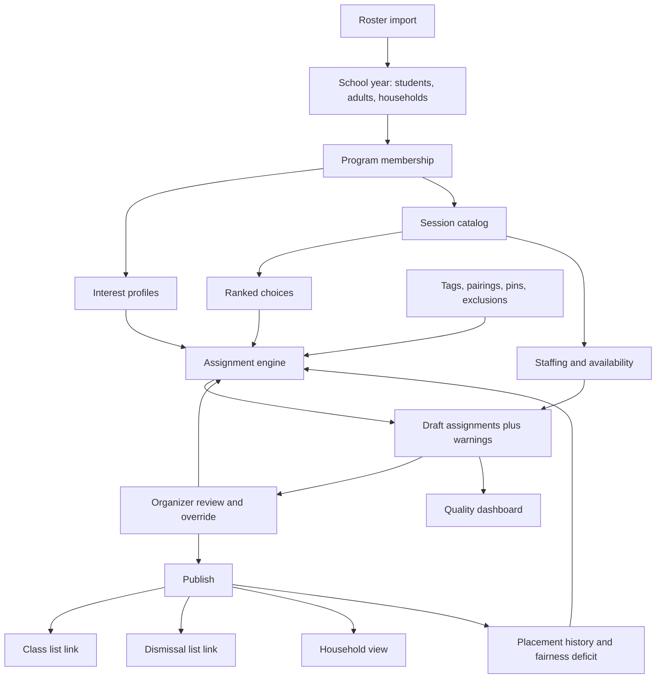
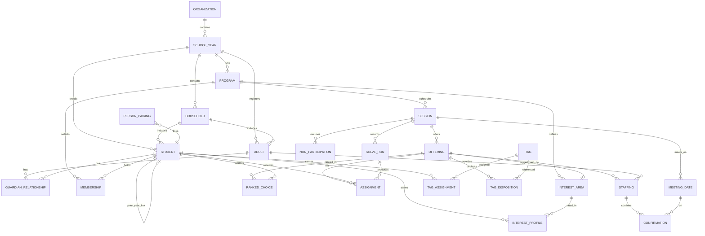
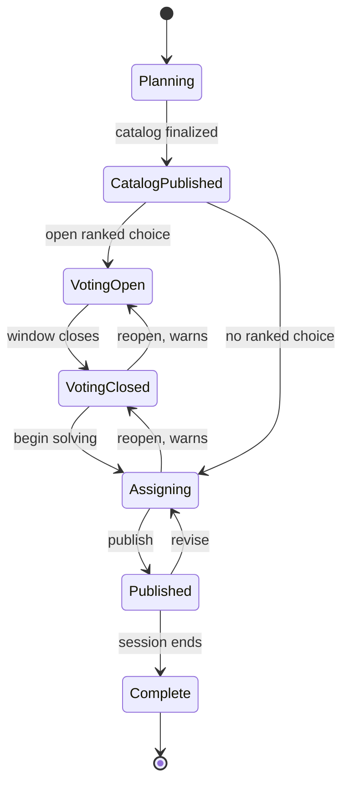

# Mini Class Planner — System Specification

**Status:** Draft v1 — complete. Sections 1–24 and both appendices are written.
**Scope:** Technology-agnostic. Describes *what* the system does, not how it is built.
**Supersedes:** `miniclassapp2` (Django prototype) and `miniclasses` (CLI pipeline), together with
the Google Forms / Sheets / Docs process wrapped around them.

---

## Contents

- [How To Read This Document](#how-to-read-this-document)
  - [Normative language](#normative-language)
  - [Provenance markers](#provenance-markers)

**Arc I — Framing**

- [1. Purpose](#1-purpose)
  - [1.1 What this system is](#11-what-this-system-is)
  - [1.2 The problem it solves](#12-the-problem-it-solves)
  - [1.3 Intended readers](#13-intended-readers)
- [2. Normative Language](#2-normative-language)
  - [2.1 RFC 2119 keywords](#21-rfc-2119-keywords)
  - [2.2 Implementation-defined semantics](#22-implementation-defined-semantics)
  - [2.3 Provenance markers](#23-provenance-markers)
- [3. Problem Statement and Background](#3-problem-statement-and-background)
  - [3.1 The operating reality](#31-the-operating-reality)
  - [3.2 The current process, end to end](#32-the-current-process-end-to-end)
  - [3.3 Where the current process breaks](#33-where-the-current-process-breaks)
  - [3.4 Corrections to the inherited record](#34-corrections-to-the-inherited-record)
  - [3.5 The migration already under way](#35-the-migration-already-under-way)
- [4. Goals and Non-Goals](#4-goals-and-non-goals)
  - [4.1 Goals](#41-goals)
  - [4.2 Non-goals](#42-non-goals)
  - [4.3 Explicitly deferred](#43-explicitly-deferred)
- [5. Design Principles](#5-design-principles)
  - [5.1 The solver drafts; the organizer decides](#51-the-solver-drafts-the-organizer-decides)
  - [5.2 Warn, do not block](#52-warn-do-not-block)
  - [5.3 Operational readiness never blocks placement](#53-operational-readiness-never-blocks-placement)
  - [5.4 Judgement is data](#54-judgement-is-data)
  - [5.5 Reproducibility](#55-reproducibility)
  - [5.6 Fresh loads over migrations](#56-fresh-loads-over-migrations)
  - [5.7 Small by design](#57-small-by-design)

**Arc II — Domain**

- [6. Personas and Roles](#6-personas-and-roles)
  - [6.1 Program organizer / administrator](#61-program-organizer--administrator)
  - [6.2 Household guardian](#62-household-guardian)
  - [6.3 Class leader and helper](#63-class-leader-and-helper)
  - [6.4 Homeroom teacher](#64-homeroom-teacher)
  - [6.5 Student](#65-student)
  - [6.6 Role and permission model](#66-role-and-permission-model)
- [7. System Overview](#7-system-overview)
  - [7.1 Capability map](#71-capability-map)
  - [7.2 The session as the unit of work](#72-the-session-as-the-unit-of-work)
  - [7.3 Boundaries](#73-boundaries)
  - [7.4 Overview diagram](#74-overview-diagram)
- [8. Core Domain Model](#8-core-domain-model)
  - [8.1 Entity hierarchy](#81-entity-hierarchy)
  - [8.2 People](#82-people)
  - [8.3 Program membership and session participation](#83-program-membership-and-session-participation)
  - [8.4 Class offering](#84-class-offering)
  - [8.5 Session and meeting dates](#85-session-and-meeting-dates)
  - [8.6 Assignment](#86-assignment)
  - [8.7 Identifiers](#87-identifiers)
  - [8.8 Entity relationship diagram](#88-entity-relationship-diagram)
- [9. Tenancy, Identity and Access](#9-tenancy-identity-and-access)
  - [9.1 Multi-tenancy model](#91-multi-tenancy-model)
  - [9.2 The tenancy guard](#92-the-tenancy-guard)
  - [9.3 Authentication](#93-authentication)
  - [9.4 Authorization](#94-authorization)
  - [9.5 Share-link security model](#95-share-link-security-model)
- [10. Attributes, Tags and Pairings](#10-attributes-tags-and-pairings)
  - [10.1 Concrete attributes with configurable vocabularies](#101-concrete-attributes-with-configurable-vocabularies)
  - [10.2 Tags](#102-tags)
  - [10.3 Tag dispositions](#103-tag-dispositions)
  - [10.4 Tag notes](#104-tag-notes)
  - [10.5 Tag sensitivity](#105-tag-sensitivity)
  - [10.6 Pairings](#106-pairings)
  - [10.7 Adult pairings resolve through assignment](#107-adult-pairings-resolve-through-assignment)
  - [10.8 Conflict detection](#108-conflict-detection)

**Arc III — Workflow**

- [11. School Year and Roster Ingest](#11-school-year-and-roster-ingest)
  - [11.1 The school year lifecycle](#111-the-school-year-lifecycle)
  - [11.2 Ingest mechanisms](#112-ingest-mechanisms)
  - [11.3 Source formats](#113-source-formats)
  - [11.4 Canonical import shape](#114-canonical-import-shape)
  - [11.5 Two-phase import](#115-two-phase-import)
  - [11.6 Matching rules](#116-matching-rules)
  - [11.7 Idempotency](#117-idempotency)
- [12. Programs and Interest Areas](#12-programs-and-interest-areas)
  - [12.1 Program definition](#121-program-definition)
  - [12.2 Why programs exist](#122-why-programs-exist)
  - [12.3 The interest-area vocabulary](#123-the-interest-area-vocabulary)
  - [12.4 Interest areas on offerings are optional](#124-interest-areas-on-offerings-are-optional)
- [13. Preferences](#13-preferences)
  - [13.1 Two preference models, both first-class](#131-two-preference-models-both-first-class)
  - [13.2 Interest profile](#132-interest-profile)
  - [13.3 Ranked class choices](#133-ranked-class-choices)
  - [13.4 Precedence](#134-precedence)
  - [13.5 Rating scales and the meaning of absence](#135-rating-scales-and-the-meaning-of-absence)
  - [13.6 Preference surveys](#136-preference-surveys)
  - [13.7 Collection](#137-collection)
  - [13.8 Import of preferences](#138-import-of-preferences)
  - [13.9 Open: household access mechanics](#139-open-household-access-mechanics)
- [14. Catalog, Sessions and Lifecycle](#14-catalog-sessions-and-lifecycle)
  - [14.1 Session definition](#141-session-definition)
  - [14.2 Catalog authoring](#142-catalog-authoring)
  - [14.3 Session lifecycle](#143-session-lifecycle)
  - [14.4 What each state gates](#144-what-each-state-gates)
  - [14.5 Backward transitions](#145-backward-transitions)
  - [14.6 State diagram](#146-state-diagram)
- [15. Volunteers and Staffing](#15-volunteers-and-staffing)
  - [15.1 Staffing is advisory](#151-staffing-is-advisory)
  - [15.2 Participation intent and topic interests](#152-participation-intent-and-topic-interests)
  - [15.3 Availability](#153-availability)
  - [15.4 Staffing assignments](#154-staffing-assignments)
  - [15.5 Per-date confirmation](#155-per-date-confirmation)
  - [15.6 What the system does not do](#156-what-the-system-does-not-do)

**Arc IV — Engine**

- [16. Constraints and Warnings](#16-constraints-and-warnings)
  - [16.1 The two-axis model](#161-the-two-axis-model)
  - [16.2 Inviolable rules](#162-inviolable-rules)
  - [16.3 Hard rules](#163-hard-rules)
  - [16.4 Soft rules](#164-soft-rules)
  - [16.5 Warning catalogue](#165-warning-catalogue)
  - [16.6 Warning presentation](#166-warning-presentation)
  - [16.7 Override records](#167-override-records)
- [17. Assignment Engine](#17-assignment-engine)
  - [17.1 Problem statement](#171-problem-statement)
  - [17.2 Why not the predecessor algorithm](#172-why-not-the-predecessor-algorithm)
  - [17.3 Solver capability requirements](#173-solver-capability-requirements)
  - [17.4 The objective](#174-the-objective)
  - [17.5 Cross-session fairness deficit](#175-cross-session-fairness-deficit)
  - [17.6 Variety](#176-variety)
  - [17.7 Tunable weights](#177-tunable-weights)
  - [17.8 Determinism](#178-determinism)
  - [17.9 Incremental re-solve](#179-incremental-re-solve)
  - [17.10 Infeasibility](#1710-infeasibility)
  - [17.11 Explainability](#1711-explainability)
  - [17.12 Manual operations](#1712-manual-operations)
  - [17.13 The unplaceable student](#1713-the-unplaceable-student)
- [18. Publishing and Artifacts](#18-publishing-and-artifacts)
  - [18.1 Draft and published states](#181-draft-and-published-states)
  - [18.2 Publish semantics](#182-publish-semantics)
  - [18.3 Class list](#183-class-list)
  - [18.4 Homeroom dismissal list](#184-homeroom-dismissal-list)
  - [18.5 Sensitive content exclusion](#185-sensitive-content-exclusion)
  - [18.6 Household placement view](#186-household-placement-view)
  - [18.7 Course guide](#187-course-guide)
  - [18.8 Link lifecycle](#188-link-lifecycle)
- [19. Reporting and Quality](#19-reporting-and-quality)
  - [19.1 Assignment quality dashboard](#191-assignment-quality-dashboard)
  - [19.2 Metrics](#192-metrics)
  - [19.3 Draft comparison](#193-draft-comparison)
  - [19.4 Demand analysis](#194-demand-analysis)
  - [19.5 Response tracking](#195-response-tracking)
  - [19.6 Participation reporting](#196-participation-reporting)

**Arc V — Cross-Cutting**

- [20. Audit, Comments and History](#20-audit-comments-and-history)
  - [20.1 Audit log](#201-audit-log)
  - [20.2 Immutable solve runs](#202-immutable-solve-runs)
  - [20.3 Comments](#203-comments)
  - [20.4 Comments as warning acknowledgement](#204-comments-as-warning-acknowledgement)
  - [20.5 What is not versioned](#205-what-is-not-versioned)
- [21. Data Retention and Privacy](#21-data-retention-and-privacy)
  - [21.1 What personal data is held](#211-what-personal-data-is-held)
  - [21.2 Sensitivity classification](#212-sensitivity-classification)
  - [21.3 Deletion](#213-deletion)
  - [21.4 Retention](#214-retention)
  - [21.5 Exposure surfaces](#215-exposure-surfaces)
  - [21.6 Tenant isolation as a privacy control](#216-tenant-isolation-as-a-privacy-control)
- [22. Non-Functional Requirements](#22-non-functional-requirements)
  - [22.1 Scale](#221-scale)
  - [22.2 Solver performance](#222-solver-performance)
  - [22.3 Availability and durability](#223-availability-and-durability)
  - [22.4 Accessibility and print](#224-accessibility-and-print)
  - [22.5 Observability](#225-observability)
- [23. Glossary](#23-glossary)
  - [23.1 Domain terms](#231-domain-terms)
  - [23.2 Deprecated and colliding terms](#232-deprecated-and-colliding-terms)
- [24. Deferred Items and Open Questions](#24-deferred-items-and-open-questions)
  - [24.1 Deferred to a later release](#241-deferred-to-a-later-release)
  - [24.2 Open: household access mechanics](#242-open-household-access-mechanics)
  - [24.3 Open: student direct access](#243-open-student-direct-access)
  - [24.4 Known limitation carried forward](#244-known-limitation-carried-forward)
  - [24.5 Questions for the program organizers](#245-questions-for-the-program-organizers)
- [Appendix A — As-Built Inventory of Predecessor Systems](#appendix-a--as-built-inventory-of-predecessor-systems)
  - [A.1 miniclassapp2 — the Django prototype](#a1-miniclassapp2--the-django-prototype)
  - [A.2 miniclasses — the command-line pipeline](#a2-miniclasses--the-command-line-pipeline)
  - [A.3 The surrounding manual process](#a3-the-surrounding-manual-process)
  - [A.4 Capability coverage matrix](#a4-capability-coverage-matrix)
  - [A.5 Defects of record](#a5-defects-of-record)
- [Appendix B — Historical Data Reference](#appendix-b--historical-data-reference)
  - [B.1 Volumes](#b1-volumes)
  - [B.2 Placement quality history](#b2-placement-quality-history)
  - [B.3 Survey inventory](#b3-survey-inventory)
  - [B.4 Interest-area vocabularies](#b4-interest-area-vocabularies)
  - [B.5 Override corpus](#b5-override-corpus)

---

## How To Read This Document

### Normative language

The key words `MUST`, `MUST NOT`, `REQUIRED`, `SHOULD`, `SHOULD NOT`, `RECOMMENDED`, `MAY`, and
`OPTIONAL` are to be interpreted as described in RFC 2119. `Implementation-defined` means the
behaviour is part of the implementation contract but this specification does not prescribe one
policy; implementations MUST document the choice they make.

### Provenance markers

Every requirement carries a marker indicating its prior art. This is deliberate: a substantial
fraction of this specification has never been built, and the reader should know which fraction.

| Marker | Meaning |
|---|---|
| `[Built]` | Working today in one of the two predecessor systems |
| `[Partial]` | Exists but is incomplete, or is implemented and does not work |
| `[Designed]` | Modelled or documented in a predecessor, never implemented |
| `[New]` | No prior art; decided during specification |

---

# Arc I — Framing

## 1. Purpose

### 1.1 What this system is

The Mini Class Planner is a planning and placement system for school enrichment programs: short,
volunteer-led classes that run for a few sessions at a time, outside the core curriculum, in which
every participating child must be placed into exactly one class per session.

It covers the whole operating cycle — loading a roster, collecting student preferences, recruiting
and scheduling volunteers, building a catalog of offerings, producing and refining assignments, and
publishing the result to the people who need it.

The defining characteristic of the problem is that placement is **contested and consequential**.
There are more children who want the popular class than there are seats, the constraints are a
mixture of hard rules and social judgement, and getting it wrong means a specific named child spends
four Friday afternoons doing something they said they did not want to do. The system therefore
optimizes, but it does not decide.

### 1.2 The problem it solves

Today this work is done with a survey tool, a spreadsheet, a folder of CSV files, four command-line
programs in two languages, and a word processor — with human transcription between each. §3.2 sets
out the twelve stages in full.

The cost is not only labour. The seams between tools destroy information: preference data is joined
to children by matching typed names character-for-character; the quality of an assignment run is
never measured; manual decisions are recorded in spreadsheet columns that no program reads; and
because the algorithm is randomized and unseeded, no run can be reproduced, compared, or explained
after the fact.

This specification describes a single system in which those seams do not exist.

### 1.3 Intended readers

- **Implementers**, human or agent, building the system. The document is written to be sufficient on
  its own; where it is not, it says so.
- **Program organizers**, who should be able to read the workflow sections (Arc III) and recognize
  their own job, and who are the authority on anything §24.5 flags as an assumption.
- **Future maintainers**, who will need to know not just what was decided but what was rejected and
  why — particularly in §3.4 and §17.2.

## 2. Normative Language

### 2.1 RFC 2119 keywords

The key words `MUST`, `MUST NOT`, `REQUIRED`, `SHOULD`, `SHOULD NOT`, `RECOMMENDED`, `MAY`, and
`OPTIONAL` in this document are to be interpreted as described in RFC 2119.

These keywords are used only where the distinction carries weight. Descriptive passages — background,
rationale, the appendices — are not normative, and the absence of a keyword in such a passage MUST
NOT be read as permission.

### 2.2 `Implementation-defined` semantics

`Implementation-defined` marks behaviour that is part of the implementation contract but for which
this specification does not prescribe a single policy. An implementation MUST select a behaviour and
MUST document it. It is distinct from `OPTIONAL`, which permits omitting the behaviour entirely, and
from an open question (§24), which means no decision has been reached.

### 2.3 Provenance markers

Every requirement carries one of four markers — `[Built]`, `[Partial]`, `[Designed]`, `[New]` — as
defined in the reading guide. Their purpose is estimation and risk: `[Built]` requirements have a
working reference implementation to consult, while `[New]` requirements do not and should be assumed
to carry design risk. Appendix A.4 holds the coverage matrix from which the markers derive, so any
attribution can be checked rather than taken on trust.

## 3. Problem Statement and Background

### 3.1 The operating reality

The specification is grounded in two full school years of operating data from an elementary
multiage program. The numbers matter, because they bound almost every design decision in this
document:

| Dimension | Scale |
|---|---|
| Students in the program | ~139, grades 1–6 |
| Households | ~90 |
| Participating adults | ~60 (of whom ~13 lead classes) |
| Sessions per school year | 8 |
| Offerings per session | 8–13 |
| Meeting dates per session | 3–4, consecutive Fridays, 12:45–2:00 pm |
| Homerooms | 6, paired into 2 vertical streams spanning grades 1–6 |
| Organizers | 2, rarely working simultaneously |

A session is a contiguous block of Fridays with a fixed catalog and one placement per student —
for example, Session 1 met on 3, 10, 17 and 24 October; Session 2 on 7, 14 and 21 November.

This is a small system serving a community that knows each other by name. That fact is load-bearing:
it is why social constraints (a class leader's own child, two children who cannot sit together) are
not edge cases but routine inputs, and why the organizer's judgement cannot be designed out.

### 3.2 The current process, end to end

| # | Stage | Tooling | Human judgement required |
|---|---|---|---|
| 0 | Curate the annual roster from the school directory | By hand | Names, preferred names, stream assignment |
| 1 | Design and run the preference survey | Google Forms | Which topics to offer; which dates to ask about |
| 2 | Normalize headers; scrub typed child names | By hand | **Heavy** — map free text onto the roster |
| 3 | Split household rows into per-person rows | `formparser` (Go) | Rename timestamped output |
| 4 | Join preferences to the roster | `studentjoin` (Go) | Resolve unmatched records; repeat from 2 |
| 5 | Author the session catalog | By hand | **Heavy** — offerings, capacities, grade windows, topic tags |
| 6 | Author manual overrides | By hand | **Heavy** — pins, exclusions, non-participants, staffing |
| 6b | (Newer) run per-class ranked-choice registration | `expand_registrations.py` | **Heavy** — curate ranked results into pins |
| 7 | Run the assignment algorithm | `sort_students.py` | Inspect output; re-roll if unsatisfactory |
| 8 | Archive the result under a session-numbered name | By hand | Do not forget, or later runs lose history |
| 9 | Generate class list and dismissal list | `classprinter` (Go) | Rename outputs |
| 10 | Publish to shared documents | By hand | Distribute links |
| 11 | (Annual) mid-year preference refresh | Repeat 1–4 | As above |

Stages 2, 5, 6, 6b and 7 are where the organizer's expertise lives. Any replacement that automates
them away has misunderstood the problem; the goal is to make them faster and better-informed, not to
remove them.

### 3.3 Where the current process breaks

**Identity is reconstructed by hand, every cycle.** Every join in the pipeline matches people by
exact, case-sensitive comparison of a typed full name. Parents enter child names as free text, so
the organizer must reconcile typos, nicknames, missing surnames and helpful annotations such as
`Chloe Essig (Barry, 6)` before anything will match. The failures are silent as often as they are
loud: a request to exclude `Danyka Howe` from a run had no effect at all, because the roster records
her as `Danyka Howe Scrafford`. Stable identifiers exist in the source data and are explicitly
discarded.

**The importer decays every time the survey changes.** Form responses are parsed by hard-coded
column position. Across four form generations the topic list moved from 11 to 18 to 17 to 25 options
and the number of child blocks changed from four to three. The parser now matches none of the live
forms and appears to be abandoned; the most recent year's household-to-student expansion looks to
have been done by hand in a spreadsheet.

**Assignment quality is never measured.** The tool reports no satisfaction metric, no fill rate and
no summary of any kind. Whether a run was good is judged by reading a console log. Consequently the
only quality-control mechanism is to re-run the randomized algorithm until the output looks
acceptable.

**Overrides silently violate the rules they override.** Capacity, grade window and exclusions are
enforced against the algorithm and bypassed entirely by manual placement, with no warning and no
record. One published class advertises a grade 3 to 6 range while containing two grade 1 students.

**Nothing is remembered.** The random number generator is never seeded and there is no seed option,
so no run can be reproduced. Result files are overwritten in place. Two rows in the historical
record contain a preference value the program is incapable of emitting, which means someone edited
the results by hand; nothing records who, when or why.

**The topic vocabulary is inferred from spreadsheet headers,** and the algorithm aborts if a class
is tagged with a topic no survey column mentioned. This makes it impossible to offer a class the
survey did not anticipate — archery was a real casualty — and it forced an entire service-learning
session to be tagged with unrelated topics, so that a class about throwing a birthday party for
seniors was recorded as `knitting`. That session therefore sorted against essentially random
preferences and corrupted the topic history of every session after it.

**Collected data is discarded.** The survey asks, per child, about sensory needs, and parents answer
substantively. That field appears in no parsed file, no assignment and neither published document —
the person leading the cooking class has never seen it. Per-date volunteer availability, household
grouping and source-system identifiers are likewise collected and dropped.

**Fairness is accidental.** Ties in the student ordering are broken by row position in the roster
file, so where a child's name happens to fall in a spreadsheet measurably affects their odds.

### 3.4 Corrections to the inherited record

Three capabilities are described as working in predecessor documentation and are not. They are
recorded here because the natural failure mode of a rewrite is to preserve them as requirements.

| Claim | Source | Reality |
|---|---|---|
| Assignments balance the two vertical streams | Predecessor `README` | Never implemented. Stream is read from the roster, copied to the output, and referenced by no logic. |
| Students who fared badly in an earlier session get priority in the next | Predecessor `README` | Never implemented. Prior placement quality is recorded in every result file and read by nothing. |
| Students are steered toward topics they have not yet had | Feature documentation | Implemented and inert. The rule partitions candidate classes by topic novelty, but it is applied to classes *within a single topic*, which by construction all share that topic. Enabling it changes console output and never changes an assignment. |

An implementation MUST NOT treat any of the three as existing behaviour to be preserved. §17
specifies what replaces them.

### 3.5 The migration already under way

The program is mid-transition between two different ways of asking children what they want.

The original model asks students to rate broad **topic areas** — cooking, gardening, tabletop games
— and tags each class with one topic. Its virtue is decoupling: the survey can go out in September
and serve all eight sessions, before any catalog exists. Its cost is precision, and §3.3 catalogues
where that cost is paid.

The newer model publishes the catalog first and asks students to **rank the actual classes**. It is
more accurate, it is what families have asked for in feedback, and it is where the program is
heading. It is also, at present, almost entirely manual: in the most recent session, 85 of 113
placements were transcribed by hand from ranked-choice results into a spreadsheet of pinned
assignments.

This specification treats both as first-class rather than choosing between them, because they answer
different questions — topic ratings tell the organizer *what classes to create and who to recruit*,
rankings tell them *where to put people*. §13 sets out how they coexist.

## 4. Goals and Non-Goals

### 4.1 Goals

- **One system of record.** Roster, preferences, catalog, staffing, assignments and published output
  live in one place, with no transcription between stages.
- **Placements that can be defended.** For any draft, the organizer can see how well it serves the
  children it serves worst, and for any individual placement, why it was made.
- **The organizer keeps the final say.** Every automated decision is visible, explicable and
  overridable.
- **Judgement is captured, not lost.** The reasons behind manual decisions persist and remain
  legible to the next person and the next session.
- **No child has a bad year.** Placement quality accumulates across a year and influences future
  placements, so repeated poor outcomes for the same child become visible and correctable.
- **A session takes hours, not days.**

### 4.2 Non-goals

- **Not a timetabling product.** One placement per student per session, no clash resolution across
  concurrent periods, no room scheduling beyond recording where a class meets.
- **Not a student information system.** The roster is loaded from elsewhere; this system is not the
  authority on enrolment, attendance or academic records.
- **Not an automated decision-maker.** The solver produces a proposal. A person publishes it.
- **Not a communications platform.** v1 makes information available; it does not send it (§4.3).
- **Not a general-purpose rules engine.** The constraint vocabulary is deliberately closed (§16) so
  that every rule can be explained in the interface in plain language.

### 4.3 Explicitly deferred

The following are understood, wanted, and out of scope for the first release. §24 records the
reasoning and any consequences.

- Notifications of any kind.
- Change-tracking against a published baseline.
- Direct student access to preference submission.
- Optimized matching of volunteers to classes.
- Cross-year identity resolution and roster rollover.
- Delivery of sensitive per-student information to class leaders.

## 5. Design Principles

These principles resolve ambiguity elsewhere in the document. Where a detailed requirement appears
to conflict with one of them, the conflict is a defect in the requirement.

### 5.1 The solver drafts; the organizer decides

Every automated decision MUST be visible, explicable and overridable. The system's job is to produce
a good proposal quickly and to make its weaknesses obvious; the judgement that closes the gap is the
organizer's, and the interface MUST be built for exercising it rather than for accepting defaults.

### 5.2 Warn, do not block

Soft rules surface as warnings attached to the object they concern. A warning MUST NOT prevent an
action. Warnings are not dismissible; an organizer acknowledges one by commenting on it (§20.4),
which records the reasoning rather than merely suppressing the signal.

The corollary is that the system has more than two outcomes. Its predecessor had exactly two —
silent success and fatal abort — which is why so much genuine information ended up as free text that
no program could see.

### 5.3 Operational readiness never blocks placement

A class missing a leader for one date is a recruiting problem, not an assignment problem, and
confirmations legitimately arrive after placements are made. The solver MUST NOT refuse to place
students on grounds of staffing or logistics.

This principle is stronger than it first appears, because staffing data is advisory by design
(§15.1): final volunteer sign-up may happen outside this system entirely. Nothing — not solving, not
publishing — MAY gate on staffing completeness, and the system MUST NOT warn about it.

### 5.4 Judgement is data

Override reasons, tag notes and comments are first-class, queryable records. In the predecessor,
this material lived in spreadsheet columns that no code read, which meant that the *why* behind
every non-obvious decision was invisible to the system and lost to the next organizer.

### 5.5 Reproducibility

A solve MUST be deterministic: identical inputs and seed produce an identical result. Without this,
incremental re-solving is unusable, drafts cannot be compared, and no past decision can be
reconstructed.

### 5.6 Fresh loads over migrations

Each school year is loaded independently. The system MUST NOT require reconciling a prior year's
records against the new one — families change names, split, merge and leave, and synchronizing that
is a large, permanent cost in exchange for a small analytical benefit. Prior years remain readable
as immutable history (§8.7).

### 5.7 Small by design

Each tenant is small (§3.1, §22.1). Requirements are written to be satisfiable simply at that
scale. An implementation SHOULD prefer the direct solution over the scalable one wherever the two
diverge.

---

# Arc II — Domain

## 6. Personas and Roles

Five human roles interact with the system. Only one of them has an account.

### 6.1 Program organizer / administrator

The primary user, and the only one who works in the system daily. Loads the roster, designs the
catalog, recruits and schedules volunteers, drafts and refines assignments, and publishes results.

There is normally more than one. In the reference program the work divides by domain rather than by
seniority — one organizer runs the tooling and the general sessions, another runs service-learning
recruiting and is the named contact for co-placement requests. The system MUST therefore support
multiple administrators per organization, and SHOULD support distinguishing their permissions
(§6.6). `[New]` — neither predecessor had authentication of any kind.

### 6.2 Household guardian

A parent or guardian acting for one or more students. Submits preference information, declares their
own participation intent and availability, and views their children's placements. Authenticates by
magic link (§9.3); no password, no account creation.

The authenticated household view shows **household information only** — the household's own students,
their preferences, their placements, and the household adults' own participation details. It MUST
NOT show class rosters, other households' data, or any program-wide view.

### 6.3 Class leader and helper

An adult assigned to run or support a class offering. Needs their roster, where and when the class
meets, and their co-leaders' contact details.

Access is by shared link only (§18.3), never through an account.

**The two personas do not merge.** `[New]` A class leader is very often also a household guardian —
in the reference program that is the normal case, since leaders are recruited from among the
parents. The system MUST keep the two access paths separate regardless:

- The household view shows household information only, even when the authenticated adult leads a
  class.
- Class information reaches that same person through the class link, exactly as it reaches a leader
  who has no children in the program.

This is deliberate. Merging the two would mean the contents of an authenticated view varied by the
viewer's unrelated volunteer role, which complicates the permission model, complicates the interface,
and creates a second path by which roster data can reach a household session. Keeping them separate
means the household view has exactly one shape.

### 6.4 Homeroom teacher

School staff, not program volunteers. Needs exactly one thing: at dismissal, which of their students
goes where. Six people in the reference program, using it weekly for two minutes. Access is by link.

### 6.5 Student

The subject of every placement and the author of the preferences that drive it, but not a system
user in v1. Preference submission is mediated by the household, matching current practice — the
survey addresses children directly while a parent operates the keyboard.

Direct student access is deferred (§4.3) but anticipated: §13 requires that a preference record
identify the student it describes rather than the household that submitted it, so that opening a
direct channel later is an access change and not a data-model change.

### 6.6 Role and permission model

The system MUST implement at least the following roles.

| Role | Scope | Authenticates via |
|---|---|---|
| `Owner` | Organization | Account |
| `Administrator` | Organization | Account |
| `Coordinator` | Organization | Account |
| `Household` | Own household | Magic link |
| `Class leader` | Own offerings | Tokenized link |
| `Homeroom teacher` | Own homeroom | Tokenized link |

Minimum capability separation:

| Capability | Owner | Admin | Coordinator |
|---|:--:|:--:|:--:|
| Manage administrators and organization settings | Y | | |
| Hard-delete personal data (§21.3) | Y | | |
| Create and load a school year | Y | Y | |
| Import roster; edit people | Y | Y | Y |
| Author catalog and staffing | Y | Y | Y |
| Draft, solve, pin and override assignments | Y | Y | Y |
| Publish; issue and revoke share links | Y | Y | |
| Read audit log | Y | Y | |

`Coordinator` exists for the common real case: a second organizer who does substantive work on one
program but should not be the person who publishes it or removes a family's data. Finer-grained
permissions, including per-program scoping of administrators, are `Implementation-defined`.

## 7. System Overview

### 7.1 Capability map

Seven capabilities, of which the first two are annual and the rest repeat every session.

| Capability | Cadence | Section |
|---|---|---|
| **Roster** — load and maintain students, adults, households | Annual | §11 |
| **Preferences** — standing interest profiles | Annual, refreshable | §13 |
| **Catalog** — author the offerings for a session | Per session | §14 |
| **Preferences** — ranked choices over the published catalog | Per session, optional | §13 |
| **Staffing** — assign volunteers, collect availability and confirmations | Per session | §15 |
| **Assignment** — solve, review, override, re-solve | Per session | §17 |
| **Publishing** — share links, household views | Per session | §18 |
| **Reporting** — quality, demand, participation | Continuous | §19 |

### 7.2 The session as the unit of work

A session is the natural transaction of the program: one catalog, one round of preferences, one
assignment, one publication. Almost everything the organizer does is scoped to one, and the session
lifecycle (§14.3) is the spine that orders the work.

Two things deliberately outlive the session and accumulate across the year within a program:

- **Placement quality**, which feeds the fairness deficit (§17.5), so a child served badly once is
  served first next time.
- **Placement history**, which feeds variety (§17.6), so children are steered toward things they have
  not yet done.

These two are the reason the system must hold the whole year rather than one session at a time. The
predecessor performed eight independent single-session sorts and hand-maintained roughly two hundred
rows of "they did this already" exclusions to compensate.

### 7.3 Boundaries

**Inside:** everything from an imported roster through to a published class list, including all
preference collection, all staffing coordination, all assignment logic, and the record of who
decided what.

**Outside:**

- The school's student information system. The roster arrives by import (§11.3); this system never
  writes back and is never the authority on enrolment.
- Parent communications. v1 publishes to links; distributing those links happens on whatever channel
  the school already uses (§4.3).
- Attendance, assessment, billing, and anything else that happens once a class is running. The
  system's responsibility ends when the roster is published.

### 7.4 Overview diagram



## 8. Core Domain Model

### 8.1 Entity hierarchy

```
Organization                       tenant boundary
  School Year                      people are loaded here, fresh, each year
    Student, Adult, Household
    Program                        a subset of the year's students
      Interest Area vocabulary
      Interest Profile
      Session
        Meeting Date
        Class Offering
          Assignment
          Staffing
```

The two placements that differ from the predecessors, and matter most:

**People hang off the school year, not the organization.** `[New]` A student record describes a
child *in a given year* — in grade 4, in Serena's homeroom, with these tags. Next year is a new
record. This makes historical data permanently correct: the grade a child was in when they took a
class is preserved rather than overwritten by a later promotion, which is not recoverable today.

**Programs subdivide the year, not the school.** `[Built]` A program owns its own interest-area
vocabulary, its own preferences and its own sessions, over a subset of the year's students. The
reference program already needs two: the general grades 1–6 program, and service learning, which has
its own registration, its own recruiting channel, all-grades classes and an unrelated preference
vocabulary. Modelling it as a program rather than contorting a session avoids the tagging damage
described in §3.3.

An organization MUST support multiple concurrent programs within a school year. One is the expected
case.

### 8.2 People

Three entities, all scoped to a school year.

**Student** `[Built]`

| Field | Notes |
|---|---|
| Legal given name, legal family name | Required |
| Preferred given name | Optional; displayed in preference to the legal name wherever a person is named |
| Grade | Concrete ordinal attribute, per-organization vocabulary (§10.1) |
| Homeroom | Concrete categorical attribute, single-valued (§10.1) |
| External identifier | Optional; from the source system (§8.7) |
| Prior-year link | Optional, nullable (§8.7) |
| Tags | Multi-valued, each optionally with a note (§10.2) |

**Adult** `[Built]`

| Field | Notes |
|---|---|
| Legal and preferred names | As above |
| Email | Required if the adult is to receive a magic link |
| Phone | Optional |
| External identifier | Optional |
| Participation intent | Lead, help, unavailable (§15.1) |
| Tags | As above |

An adult may be a guardian, a class leader, both, or neither. The predecessor conflated "adult" with
"teacher" in its planning module; this specification does not — the role is a property of what the
person is assigned to do, not of the person.

**Household** `[Built]` — a grouping of adults and students used for preference submission scope,
magic-link addressing, and sibling reasoning.

A student MAY belong to more than one household. This is not an edge case: the reference program ran
a separate second-household survey specifically to serve separated families, and the wide import
format's inability to express it is a documented limitation (§11.4).

**Guardian relationship** `[Built]` — links an adult to a student with a relationship type (parent,
guardian, grandparent, other). Distinct from household membership, because the two do not always
coincide.

### 8.3 Program membership and session participation

Participation is decided at two levels, and conflating them is a defect in the predecessor.

**Program membership** `[Built]` is annual: which of the year's students take part in this program
at all. Typically a grade range, but membership is explicit rather than derived, so exceptions are
expressible.

**Session participation** `[Partial]` is per session: a member MAY be excluded from an individual
session. This is a real and routine need — in the reference data the entire grade 5 and 6 cohort was
excluded from the final session of the year — and the predecessor served it with a flat list of
names in a file that was overwritten each session, with no reason, no session scope and no history.

The system MUST record session non-participation as a first-class, session-scoped record with a
reason. It MUST NOT be expressed by removing the student from the program.

A student who is not participating in a session MUST NOT be assigned, MUST NOT appear as unplaced,
and MUST NOT accrue a fairness deficit (§17.5) for that session.
### 8.4 Class offering

One class, in one session. The unit students are assigned to.

| Field | Notes | Marker |
|---|---|---|
| Name | Required | `[Built]` |
| Description | Required when the session uses ranked choice — students cannot rank what they cannot read | `[Partial]` |
| Minimum viable enrollment | Optional; drives an under-enrollment warning | `[New]` |
| Maximum capacity | Required; solver-hard, human-overridable | `[Built]` |
| Grade window | Minimum and maximum, inclusive; solver-hard, human-overridable | `[Built]` |
| Location | Where the class happens | `[Built]` |
| Meeting point | Where students gather, when it differs from the location | `[Built]` |
| Meeting instructions | Free text for finding or accessing the location | `[Built]` |
| Interest area | Optional (§12.4) | `[Partial]` |
| Tags with dispositions | §10.3 | `[New]` |

Description is marked `[Partial]` because the Django prototype modelled it and the command-line
pipeline dropped it; ranked-choice voting cannot work without it.

An offering meets on every meeting date of its session. Per-date variation is a staffing concern
(§15.4), not a class-structure concern.

### 8.5 Session and meeting dates

**Session** `[Built]` — name, ordinal position within the program's year, lifecycle state (§14.3).

**Meeting date** `[Built]` — a specific date on which the session's classes meet. Three or four per
session in the reference program, on consecutive Fridays.

Meeting dates are not decoration. They are the granularity at which volunteer availability is
collected and confirmed (§15.2, §15.4), and the reason the predecessor could not use the
availability data it gathered is that it had nowhere to put a date.

### 8.6 Assignment

A student placed in an offering for a session.

| Field | Notes |
|---|---|
| Student, offering | The placement itself |
| Origin | Solver-produced, or manually pinned |
| Pinned | Whether the placement is locked against re-solve (§17.9) |
| Realized preference | The student's stated preference for what they received, captured at solve time |
| Warnings | Soft-rule violations attached to this placement (§16.5) |
| Overrides | Hard-rule violations accepted by a named person, with optional reason (§16.7) |
| Comments | §20.3 |

A participating student MUST have exactly one assignment per session (§16.2). This is invariant, not
configurable.

**Realized preference MUST be stored on the assignment, not recomputed.** Preferences can be edited
after a placement is made, and a placement's quality is a fact about the moment it was decided. The
predecessor recomputed it, which is one reason its history cannot be trusted.

### 8.7 Identifiers

**Internal identity.** Every entity has a system-generated, stable, opaque identifier. Nothing in
the system MAY use a person's name as a key. `[Built]` in the Django prototype, and the single most
consequential failing of the command-line pipeline, where every join in every stage was an exact
case-sensitive comparison of a typed full name (§3.3).

**External identifiers.** `[Partial]` A student or adult MAY carry an identifier from the source
system. When present, import matches on it in preference to names (§11.6), which makes repeated
partial imports idempotent. The predecessor read such a column and explicitly declined to use it for
matching.

**Prior-year link.** `[New]` A student record MAY carry a nullable reference to the same child's
record in an earlier year. It is an annotation, never a requirement, and nothing in the system
depends on it.

Cross-year identity is deliberately weak (§5.6). A prior-year record is immutable history, not a
live record to be kept in agreement, so the link imposes no synchronization burden: a name change, a
household restructuring or a correction in the new year does not propagate backwards and does not
need to. What the link buys is the ability to ask, later, how a child fared across several years —
and nothing more.

### 8.8 Entity relationship diagram



## 9. Tenancy, Identity and Access

Everything in this section is `[New]`. Neither predecessor had authentication, authorization or any
notion of a tenant.

### 9.1 Multi-tenancy model

The organization is the tenant boundary. Tenancy is enforced by row, not by database or schema:
every tenant-scoped row carries an `organization_id`.

- Every entity in §8 except the organization itself MUST be tenant-scoped.
- A reference from one row to another MUST NOT cross an organization boundary. An implementation
  SHOULD enforce this in the data layer rather than in application logic.
- Identifiers MUST NOT be assumed globally unique across tenants by any consumer, including share
  links (§9.5).

The decision to build this in from the start, rather than adding it later, is deliberate: retrofitting
tenancy means auditing every query ever written, and the failure mode of missing one is disclosing
one school's children to another.

### 9.2 The tenancy guard

Tenant scoping MUST be enforced centrally and MUST be default-deny. It MUST NOT depend on each query
remembering to filter.

- Data access MUST occur through a path that requires a tenant context; a query issued without one
  MUST fail rather than return unscoped rows.
- The guard MUST apply to reads, writes, aggregate queries and reports alike.
- Cross-tenant access MUST NOT be reachable through any authenticated path. Any administrative or
  operational need to work across tenants is `Implementation-defined` and MUST be a separate,
  audited mechanism.
- The test suite MUST include cross-tenant isolation tests. A tenant-scoped entity added without a
  corresponding test is a defect.

### 9.3 Authentication

Four mechanisms, deliberately unequal.

| Principal | Mechanism | Lifetime |
|---|---|---|
| Owner, Administrator, Coordinator | Account with credential | Session-based, renewable |
| Household guardian | Emailed magic link | Scoped to a submission window |
| Class leader, Homeroom teacher | Tokenized link | Scoped to a session |
| Public reader | Unauthenticated share link | Scoped to a session, expiring (§9.5) |

Only administrators have passwords. This is a requirement, not an accident of scope: the population
is ~90 households and ~60 volunteers who use the system a handful of times a year, and account
management for that population would cost more in support than it returns in security.

A magic link MUST be single-purpose and scoped to the household it was issued to. It MUST NOT grant
access to any other household's data, and MUST NOT be reusable after its window closes.

### 9.4 Authorization

- Authorization MUST be decided server-side on every request. Client-side gating is presentation
  only.
- The tenant check MUST precede the permission check. A request for another tenant's data MUST fail
  as not-found, not as forbidden.
- Role capabilities are specified in §6.6. Granularity beyond that minimum is
  `Implementation-defined`.
- Link-based principals are authorized for exactly the objects their link names — a class leader's
  token grants their offerings and nothing else, including no visibility of other offerings in the
  same session.

### 9.5 Share-link security model

Published artifacts (§18) are readable by anyone holding the URL. This replicates the existing
practice of sharing a document with anyone who has the link, and it is chosen knowingly.

Requirements:

- A share link MUST be scoped to a single session and a single artifact type.
- A share link MUST have an expiry. The default SHOULD be the end of the session it belongs to.
- A share link MUST be regenerable, which invalidates the previous URL, and MUST be revocable
  outright.
- Link tokens MUST be high-entropy and unguessable, and MUST NOT encode tenant, session or student
  identifiers.
- Published pages MUST discourage search-engine indexing.
- Published pages MUST NOT contain content marked sensitive (§10.5, §18.5).

**Stated plainly:** obscurity is the only access control on this channel. The link is forwardable,
and once forwarded it cannot be recalled except by regenerating it. The content is therefore
restricted by policy (§18.5) to what the program already publishes this way today — names, grades,
homerooms and class placements — and expiry exists so that a link leaked in May stops working in
June rather than resolving forever.

## 10. Attributes, Tags and Pairings

This section defines how the system describes people and how those descriptions become placement
rules. It is the vocabulary §16 and §17 operate on.

### 10.1 Concrete attributes with configurable vocabularies

Two student properties are concrete fields rather than tags, because each has semantics a tag cannot
carry.

**Grade** is ordinal. `[Built]` The eligibility rule on every offering is a range — grades 3 to 6 —
which requires the values to be ordered. Each organization defines its own ordered grade vocabulary
(`K, 1–12`, or `Reception, Y1–Y6`, or `1–6`); the ordering is the definition's, not the string's.
`[New]`

**Homeroom** is categorical and single-valued. `[Built]` The dismissal list pivots on it, one
section per homeroom, which requires every student to have exactly one. Each organization configures
the label (`homeroom`, `class`, `form`, `advisory`) and the value set. `[New]`

Everything else that describes a student is a tag. In particular, the reference program's *stream* —
its two vertical cohorts — is a tag, not a field: it is unordered, carries no special semantics, and
is used only for display and balance.

A fully generalized attribute system, in which grade and homeroom are ordinary configurable
definitions, was considered and rejected for v1: it costs generic forms, generic validation and an
interface that cannot speak specifically about anything, in exchange for flexibility no observed
program needs. The promotion path is non-breaking — the model here is that system with two
definitions fixed — so it remains available if a program appears that is not grade-structured.

### 10.2 Tags

`[New]` A tag is a named concept defined per program, assignable to students, and referenced by
offerings.

- A student MAY carry any number of tags.
- A tag assignment MAY carry a note (§10.4) and inherits the tag's sensitivity level (§10.5).
- Tags MUST be managed in the application. They MUST NOT be inferred from imported column headers —
  the predecessor derived its vocabulary that way, which is why offering a class the survey had not
  anticipated caused a hard failure (§3.3).

Tags are how the system absorbs requirements that would otherwise each need a schema change:
sensory needs, stream, mobility considerations, prior-year participation, consent on file, and the
ad-hoc observations that currently live in an untracked notes file.

### 10.3 Tag dispositions

`[New]` An offering declares its relationship to a tag as exactly one of four dispositions. This is
how a descriptive fact about a child becomes a placement rule.

| Disposition | Meaning | Enforcement |
|---|---|---|
| `requires` | Only students carrying the tag are eligible | Solver-hard, human-overridable |
| `prefers` | Students carrying the tag are favoured | Soft; enters the objective |
| `discourages` | Students carrying the tag are disfavoured | Soft; enters the objective |
| `excludes` | Students carrying the tag are ineligible | Solver-hard, human-overridable |

The hard dispositions follow the general rule of §16.1: binding on the solver, overridable by a
person, and every override recorded and warned. The soft dispositions never block anything; they
shift the objective and raise a visible warning when violated.

Worked example. A cooking class that involves loud equipment and sticky textures declares
`discourages: sensory-sensitive`. The solver avoids placing such students there when it reasonably
can. If it must — or if the organizer decides the child would love it — the placement happens and
carries a warning, and the organizer records why in a comment.

### 10.4 Tag notes

`[New]` A student's tag assignment MAY carry free text.

This exists because the useful part of most such facts is not the fact. "Sensory needs" is a
boolean; *"sensitive to loud sounds and sticky textures, does well if told in advance and can wash
hands immediately"* is what the person running the class actually needs. The tag is the part the
optimizer can read; the note is the part a human can act on.

Notes are `[New]` in the sense that no predecessor stored them, but the underlying data is `[Built]`:
the survey has always asked the question, and the answer has always been discarded (§3.3).

### 10.5 Tag sensitivity

`[New]` Every tag declares a sensitivity level, which governs where the tag and its notes may
appear.

| Level | Visible to | May appear in published artifacts |
|---|---|---|
| `Public` | All roles with access to the object | Yes |
| `Internal` | Administrators; class leaders for their own students | No |
| `Sensitive` | Administrators only | No |

The system MUST enforce these levels at the point of rendering, in every surface including exports
and print views. A tag's sensitivity MUST be set when the tag is defined, and changing it MUST
re-evaluate everywhere it is displayed.

**v1 scope.** No tag content of any sensitivity appears in a published artifact, and the `Internal`
visibility to class leaders is not implemented (§18.5, §24.4). The three levels are specified now
because the distinction must exist in the data from the outset; a later release turns on the
leader-facing surface without a migration.
### 10.6 Pairings

`[New]` A pairing expresses a relationship between two people that should influence placement.

| Property | Rule |
|---|---|
| Participants | Any two people in the school year — student to student, or student to adult |
| Disposition | `requires`, `prefers`, `discourages`, `excludes` — same semantics as §10.3 |
| Symmetry | Symmetric. A pairing has no direction |
| Scope | Program-scoped; MAY be further scoped to a single session |
| Validity | Has an active period; expired pairings do not bind |
| Reason | Free text, optional but prompted |
| Sensitivity | As §10.5 |

Pairings are symmetric because the underlying facts are: two children who cannot sit together cannot
sit together in either direction. Asymmetric situations are adequately served by a symmetric
`excludes`.

Pairings are dated because the facts expire. A falling-out in January should not silently govern
placements the following November, and the predecessor's approach — accumulating permanent exclusion
rows — has no mechanism for forgetting.

This single construct replaces several things the predecessor handled by hand: sibling co-placement,
keeping two children apart, and the largest category of manual pinning (§10.7).

### 10.7 Adult pairings resolve through assignment

`[New]` When a pairing names an adult, it is evaluated against wherever that adult is currently
assigned to lead or help (§15.3).

This is the highest-volume manual task in the current process. Placing a class-leading parent with
their own child is advertised program policy — *"if you participate, we are happy to put your kid(s)
in the same class with you"* — and it is implemented today by hand-entering a pinned assignment
every session, with `parent` written in a note column.

As a standing pairing it becomes declarative and self-maintaining:

- The solver places the child with the parent's class automatically.
- If the parent moves to a different class, the constraint follows them; the child is re-placed on
  the next solve rather than silently stranded.
- If the pairing cannot be honoured, it surfaces as a warning — which is exactly the flag requested
  in §16.4, obtained for free rather than as a special case.

An adult with no staffing assignment makes any pairing naming them unresolvable. Because staffing
data is advisory and may be incomplete by design (§15.1), this MUST be surfaced as an informational
note on the pairing rather than as a warning implying error — the adult may well be leading a class
that was organized elsewhere. The pairing simply exerts no influence on the solve.

### 10.8 Conflict detection

`[New]` Rule sets can be unsatisfiable. `requires(A,B)` together with `excludes(B,C)` and
`requires(A,C)` cannot be met; a `requires` pairing between students whose grade windows do not
overlap any common offering cannot be met; a tag `requires` on an offering with no qualifying
students cannot fill it.

Requirements:

- The system MUST detect contradictory rule sets and report them explicitly, naming the specific
  rules in conflict.
- Detection SHOULD occur when rules are authored, not only when a solve fails.
- A solve that fails for constraint reasons MUST identify the constraints responsible (§17.10). It
  MUST NOT report a bare infeasibility.
- Conflicts are reported, never auto-resolved. Choosing which rule yields is a human decision.

This matters more than its size suggests. The predecessor's failure mode for any bad rule was an
assertion with a terse message, or in several cases silent non-enforcement — an exclusion naming a
student whose name did not match the roster simply did nothing, forever, with no indication.

---

# Arc III — Workflow

## 11. School Year and Roster Ingest

### 11.1 The school year lifecycle

A school year is created, loaded with people, run, and closed. There is no rollover (§5.6).

| State | Meaning |
|---|---|
| `Setup` | People are being loaded and corrected. No programs are running. |
| `Active` | Programs and sessions are operating. People may still be added and corrected. |
| `Closed` | The year is over. Records become read-only history. |

Closing a year MUST NOT be required in order to create the next one. Two years MAY be `Active`
simultaneously during a transition.

Records in a `Closed` year remain readable, and remain the target of prior-year links (§8.7), but
MUST NOT be edited. This is what makes historical placement data trustworthy — the predecessor's
history was mutable files that were, in at least two demonstrable cases, edited by hand after the
fact (§3.3).

### 11.2 Ingest mechanisms

The system MUST support both:

- **Structured import** `[Built]` for bulk loading, at the start of a year and repeatedly as
  families arrive.
- **Manual creation and editing** `[Built]` of every person, household and relationship.

Both are required. Import alone fails the routine case of one family joining in November; manual
entry alone fails the annual load of ~140 students and ~60 adults.

### 11.3 Source formats

`[Partial]` The importer MUST be format-agnostic, with pluggable source parsers. A parser's sole job
is to translate a source document into the canonical shape (§11.4); everything downstream —
validation, matching, preview, commit — operates on the canonical form and is identical regardless
of source.

At minimum the system MUST support delimited text (CSV) and MUST support at least one structured
document format (JSON) suitable for consuming a community-platform export directly.

An implementation SHOULD offer materializing a parsed source to CSV before import, for organizers
who want a file they can inspect or amend. This is a convenience, not a required stage: because
preview (§11.5) is mandatory and operates on normalized rows, human review is guaranteed regardless
of format.

The predecessor's importer read source documents by hard-coded column position, which is why it
broke on every survey revision and was eventually abandoned (§3.3). Parsers MUST resolve fields by
name or by explicit mapping, never by position.

### 11.4 Canonical import shape

Three record types:

| Record | Contents |
|---|---|
| Student | Names, grade, homeroom, optional external identifier, optional household key |
| Adult | Names, email, phone, optional external identifier, optional household key |
| Guardian relationship | Adult reference, student reference, relationship type |

Separate records per type is the documented format. `[New]`

A **wide format** — one row per adult, with several students named inline — MUST also be supported,
because it is the natural shape of a household survey export and is what the reference program
already produces. `[Built]`

The wide format has a known limitation that the documented format does not: it cannot express a
student with guardians in two households. This is not hypothetical — the reference program ran a
separate second-household survey precisely for separated families. Implementations MUST NOT treat
the wide format as fully expressive, and the preview MUST make clear when a wide import would
replace rather than augment an existing relationship set.

### 11.5 Two-phase import

`[Built]` Every import MUST be a two-phase operation: **preview**, then **commit**. The predecessor's
Django prototype did this and it is the single best idea in either codebase.

The preview MUST classify every row into one of:

| Outcome | Meaning |
|---|---|
| `Create` | No existing record matches; a new one will be created |
| `Update` | Matched an existing record; listed field changes will be applied |
| `Unchanged` | Matched, no differences |
| `Conflict` | Matched more than one record, or contradicts existing data; requires resolution |
| `Error` | Invalid or unusable; cannot be imported |

Requirements:

- Commit MUST NOT be possible while any row is in `Error`.
- Commit MUST be atomic: either every non-error row is applied, or none is.
- `Conflict` rows MUST be resolvable individually, and MUST NOT be auto-resolved.
- The preview MUST show what will change, field by field, for `Update` rows. "27 students updated"
  is not sufficient.

### 11.6 Matching rules

Matching determines whether an incoming row is a new person or an existing one.

1. **External identifier.** `[Partial]` If the row carries one and it matches, that is the match.
   No further comparison is performed.
2. **Name.** `[Partial]` Otherwise, compare given and family names, normalized: case-insensitive,
   surrounding whitespace removed, internal whitespace collapsed.
3. **Ambiguity.** If step 2 yields more than one candidate, the row is a `Conflict`. The system MUST
   NOT choose.

Matching MUST NOT be case-sensitive exact comparison. This is called out because it is the
predecessor's defining failure: every join in every stage compared typed names character for
character, which produced silent non-matches that persisted for entire sessions (§3.3).

Name normalization deliberately stops short of fuzzy matching. Nicknames, transposed names and
misspellings are surfaced as unmatched rows for a human to resolve, and the system SHOULD offer
likely candidates — but it MUST NOT merge records on similarity alone.

### 11.7 Idempotency

`[New]` Re-importing an unchanged source MUST produce zero changes and report every row as
`Unchanged`.

This is a hard requirement rather than a nicety, because the observed working pattern is repeated
partial import: the organizer re-exports the survey as new families respond and imports again. Under
the predecessor's approach — append the new rows to the bottom of the working file by hand — that
was a manual diff performed by a person. Here it MUST be automatic and safe to repeat.

## 12. Programs and Interest Areas

### 12.1 Program definition

`[Built]` A program is a named body of enrichment activity within a school year, with its own
membership, its own preference vocabulary, and its own sessions.

| Property | Notes |
|---|---|
| Name | Required |
| Membership | Explicit set of the year's students (§8.3) |
| Interest-area vocabulary | Managed list (§12.3) |
| Tag definitions | §10.2 |
| Sessions | §14 |
| Objective weights | Defaults for the assignment engine (§17.7) |

Membership is explicit rather than derived from a grade range. A rule such as "grades 1 to 6" is a
convenient way to *populate* membership, but the stored fact is the list, so that exceptions are
expressible without contorting the rule.

### 12.2 Why programs exist

One program is the expected case, and a reader could reasonably ask why the concept is needed at
all. The answer is that the reference operation already has two, and forcing the second into the
first caused measurable damage.

Service learning differs from the general program in every dimension that matters: its own
registration form, its own recruiting channel, its own coordinator, classes open to all grades with
no grade banding, and a set of offerings — packaging food parcels, building a roof for orchard play
huts, hosting a birthday party for care-home residents — that has no overlap with a topic vocabulary
built around cooking, gardening and tabletop games.

Run as an ordinary session of the general program, it had to borrow that vocabulary. Every offering
was tagged with an unrelated topic: the birthday party became `knitting`, the food-parcel class
became `athletics`. Two consequences followed. The session's assignment ran against effectively
random preferences, and every subsequent session's variety tracking was corrupted, because the
system now believed those children had done knitting and athletics.

A program boundary makes that impossible.

### 12.3 The interest-area vocabulary

`[Partial]` Each program defines an ordered, managed list of interest areas — the topic categories
students rate in their interest profile (§13.2).

Requirements:

- The vocabulary MUST be editable in the application.
- It MUST NOT be inferred from the column headers of an imported file.
- Adding an area MUST NOT invalidate existing profiles; students simply have no rating for it.
- Retiring an area MUST preserve historical ratings and prior placements referencing it, and MUST
  exclude it from future surveys (§13.6).
- An area has a **stable identity** and a separate **display label**. The label MAY be edited freely
  without affecting stored ratings, historical placements or variety tracking.

The identity-versus-label separation is not pedantry. Labels drift constantly in practice: the same
concept appears as `Arts and crafts` in one question and `Arts & Crafts` in another of the *same*
form, and a fibre-arts label silently gained "Weaving" between generations. If the label is the
identity, every such edit fragments a student's history.

The prohibition on inferring the vocabulary is the direct fix for the predecessor's most obstructive
defect. There, the set of valid areas was whatever appeared as an `interest_*` column in the survey
export, and an offering tagged with anything outside that set caused the assignment run to abort.
The practical effect was that the catalog could only contain classes the survey had already thought
of — offering archery was blocked outright — and that a mid-year survey revision silently changed
what the catalog was permitted to contain.

### 12.4 Interest areas on offerings are optional

`[Partial]` An offering MAY carry an interest area. It MUST NOT be required.

Where present, the area is used for:

- matching against interest profiles when a session has no ranked choices (§13.4);
- variety tracking across the year (§17.6);
- demand analysis when designing future catalogs (§19.4).

Where absent, the offering is placed on ranked choices alone, contributes nothing to variety
tracking, and appears in demand analysis as untagged. Its absence MUST NOT block creating the
offering, publishing the catalog, or solving.

The area tag is metadata, not a join key. A session that uses ranked choice needs no areas at all,
which is precisely what makes §12.2's service-learning case work cleanly.

## 13. Preferences

### 13.1 Two preference models, both first-class

The system supports two ways of asking a student what they want, and treats both as primary.

| | Interest profile | Ranked choices |
|---|---|---|
| Subject | Topic area | A specific offering |
| Timing | Before any catalog exists | After the catalog is published |
| Cadence | Annual, refreshable | Per session, optional |
| Answers | "What is this child interested in?" | "Which of these should they get?" |
| Drives | Catalog design, recruiting, fallback placement | Placement |
| Marker | `[Built]` | `[Partial]` |

They are not two implementations of one idea; they answer different questions and are needed at
different moments. The interest profile is what tells an organizer *which classes to create and
which volunteers to recruit* in September, and it is the only signal available for a student who
never responds to anything. Ranked choices are more accurate, are what families have asked for, and
are what should decide a placement when they exist.

### 13.2 Interest profile

`[Built]` A student's standing ratings across their program's interest areas (§12.3).

- Scoped to a student and a program.
- Catalog-independent — collectable before any session exists.
- Refreshable during the year without discarding what came before.

**Refresh semantics.** `[Partial]` A profile submission MUST be stored as a distinct record rather
than overwriting the previous one. The student's *effective* profile is, for each area, the most
recent rating submitted for that area.

This matters because refreshes are partial in practice. The reference program's mid-year survey
dropped one topic, added nine new ones, and was answered by roughly half the students. Overlaying
per area means a student who answered in September and not in January keeps their September ratings
for the areas both surveys covered, and simply has no rating for the new ones — which is correct.
Wholesale replacement would silently destroy the earlier answers of every non-responder.

Storing submissions rather than a merged blob also preserves the answer to "what did they say, and
when", which the predecessor could not reconstruct.

### 13.3 Ranked class choices

`[Partial]` A student's ordering of the actual offerings in one session.

For each offering in the session, a student's response is exactly one of:

| Response | Meaning |
|---|---|
| Rank `1..N` | An ordered choice. `N` is configurable per session |
| `Interested` | Acceptable, but not among the ranked choices |
| `Not interested` | Explicitly unwanted |
| *(no response)* | No opinion expressed (§13.5) |

Ranked choices require a published catalog (§14.3) and therefore require offering descriptions
(§8.4) — a student cannot rank what they cannot read.

A rank MUST be unique within a student's response for a session; two offerings cannot both be first
choice. The system MUST prevent this at entry rather than resolving it at solve time.

This model is `[Partial]` because it exists in practice but not in software: the reference program
ran exactly this survey, then transcribed the results into pinned assignments by hand — 85 of 113
placements in the most recent session (§3.5).

### 13.4 Precedence

Where both exist, ranked choices govern.

Precedence is evaluated **per student**, not per session:

1. If the student submitted ranked choices for this session, those decide their placement.
2. Otherwise, their effective interest profile decides it, via the offering's interest area (§12.4).
3. Otherwise — no ranked choices, no profile, or no area tags to match on — the student is placed on
   constraints alone, and every such placement MUST be flagged (§16.5).

A session in which some students voted and others did not is therefore normal and fully supported.
This is the common case: response rates to the reference program's surveys ranged from roughly 55%
to 90%, and the students who never respond are exactly the students most at risk of a poor
placement.

An offering with no interest area cannot be matched at step 2. Such an offering is reachable only
via ranked choices or manual placement, which is an intended consequence of §12.4 and MUST be
surfaced to the organizer when the catalog is built.
### 13.5 Rating scales and the meaning of absence

`[Partial]` The interest-profile scale is ordered and configurable per program. The default SHOULD
be the three-point scale in continuous use by the reference program:

| Value | Ordering |
|---|---|
| Very interested | Highest |
| Interested | Middle |
| Not interested | Lowest |

The scale has no neutral midpoint, by design. Adding one is a program configuration decision, not an
implementation choice.

**Absence is not a rating.** The system MUST distinguish three states that the predecessor conflated:

| State | Meaning |
|---|---|
| Rated | The student expressed a level of interest |
| Unrated | The student responded, but said nothing about this area |
| No response | The student has no submission at all |

An absent rating MUST NOT be interpreted as interest, as disinterest, or as a fourth scale value. It
MUST NOT disadvantage the student in solve ordering or in the objective (§17.4).

This requirement exists because the predecessor got it backwards, in a way worth recording so it is
not reintroduced. It materialized every unrated area as a synthetic "unknown" value, then counted
those synthetic values *together with* "very interested" when deciding which students to serve
first — a student with fewer options being served earlier. The arithmetic consequence is that a
student who never responded scored the maximum possible value and was served **last**, after every
student who had expressed a preference. The children about whom the system knew least were
systematically placed from whatever was left over.

The correct treatment is the opposite, or at minimum neutral: absence of information is not evidence
of low need. §17.4 specifies the ordering that replaces it.

### 13.6 Preference surveys

`[Partial]` Interest profiles are collected through **surveys**: curated instruments that an
administrator composes, opens to a population, and closes. A program runs at least one a year and
often more.

The survey is a distinct entity from the vocabulary. The vocabulary (§12.3) is every topic a program
has ever asked about; a survey is a *curated subset*, asked at one moment, for one purpose. The
reference program's four survey generations asked 11, 18, 17 and 25 areas respectively, drawn from
an accumulating pool (Appendix B.4).

#### 13.6.1 Survey definition

| Property | Notes |
|---|---|
| Name | For example "2025–26 Annual Interests", "Mid-Year Refresh" |
| Program | The scope it belongs to |
| Included areas | An ordered subset of the program vocabulary |
| Audience | Which students it is addressed to (§13.6.2) |
| Window | Opening and closing time |
| State | Draft, Open, Closed |
| Introduction | Free text shown to respondents |

Curation rules:

- A survey MUST draw its areas from the program vocabulary. It MUST NOT introduce an area ad hoc —
  adding to the vocabulary is a separate, deliberate act (§12.3).
- Any subset and ordering is permitted.
- A survey SHOULD be duplicable, so composing next term's refresh starts from last term's.
- A survey presents each area using that area's display label (§12.3). There is no per-survey
  override; changing how a topic is worded is an edit to the area itself, and applies everywhere.

#### 13.6.2 Audience

A survey is addressed to all program members by default. It MUST be possible to narrow that:

- to an explicit list of students;
- by attribute, such as grade;
- by response state — for example, everyone who has not responded to a named earlier survey.

The response-state filter is the one that earns its place. Non-responders are the students most
exposed to a poor placement (§13.4), and chasing them is currently done by diffing files (§19.5).

#### 13.6.3 Effect on the interest profile

This is the part that most needs stating precisely, because it is where a naive implementation
destroys data.

- A submission records ratings **only for the areas that survey included**.
- A student's effective profile is, for each area, the most recent rating submitted for it (§13.2).
- **Omitting an area from a later survey MUST NOT clear an earlier rating.** Absence from an
  instrument is not an answer.
- **An area newly introduced by a survey is unrated** for anyone who does not respond. It MUST be
  treated as absent, never as neutral or as any scale value (§13.5).
- Retiring an area MUST NOT alter historical ratings.

Worked example, using the reference program's actual figures. The annual survey asks 17 areas and
nearly everyone responds. The mid-year refresh asks 25 — dropping one, adding nine — and roughly
half respond.

| Student | Outcome |
|---|---|
| Answered annual only | Keeps all 17 annual ratings; has no rating for the 9 new areas |
| Answered both | Mid-year values for the 24 areas it covered; **retains** the annual value for the area mid-year dropped |
| Answered neither | No ratings at all; placed on constraints alone and flagged (§13.4) |

Wholesale replacement on each submission would silently erase the September answers of every
non-responder to the January survey — roughly half the program.

#### 13.6.4 Lifecycle

| State | Behaviour |
|---|---|
| `Draft` | Composable; not visible to respondents |
| `Open` | Accepting submissions within the window |
| `Closed` | No further submissions |

A closed survey MAY be reopened, with a warning, on the same reasoning as §14.5 — a family that
missed the deadline is a routine case, and forbidding it only pushes the fix outside the system.
Reopening MUST be recorded in the audit log.

A survey MUST NOT be deleted once it has submissions; it is closed and retained, because the
submissions are the provenance of the effective profile.

#### 13.6.5 Relationship to ranked choices

Ranked-choice collection is **not** composed this way. Its instrument is the session catalog itself
(§13.3) and its window is the session lifecycle (§14.3), so there is nothing to curate — the
questions are the offerings. The survey entity described here governs interest profiles only.

### 13.7 Collection

`[New]` Preferences are collected natively. This is the single largest source of eliminated manual
work in the specification.

Requirements:

- A preference record MUST be bound to a specific student at the moment of creation. It MUST NOT
  identify the student by typed name.
- A submission MUST record who submitted it and when.
- Collection MUST be scoped by a submission window with an opening and closing time. For ranked
  choices this is governed by the session lifecycle (§14.3).
- The system MUST be able to report, at any time, which students have not responded (§19.5).
- A household MAY submit for all of its students in one sitting; the resulting records are
  per-student (§6.5).
- Re-submission before the window closes MUST be permitted and MUST supersede per §13.2.

Binding to a student at creation is what deletes the entire identity-reconciliation stage described
in §3.2 and §3.3 — the name scrubbing, the join tooling, the unmatched-record review loop, and the
hard abort that gated the whole pipeline on it. Those stages do not become better; they cease to
exist.

### 13.8 Import of preferences

`[New]` Preferences MUST also be importable, using the same two-phase mechanism as §11.5.

This serves three purposes: migrating two prior years of history so that variety and fairness have
something to work with from day one; backfilling a survey run outside the system; and entering
responses collected on paper.

Imported preference rows are matched to students by the rules in §11.6. Unmatched rows MUST be
reported for resolution and MUST NOT be discarded silently.

### 13.9 Open: household access mechanics

The mechanics of household authentication are flagged as needing refinement and are not fully
specified here (§24.2). Open points include: link delivery and renewal; whether a link addresses a
household or an individual adult; how an adult belonging to two households is handled; and how a
volunteer who is not a guardian obtains access in order to declare availability (§15.3).

What is settled: authentication is by emailed link rather than password (§9.3), the authenticated
view shows household information only (§6.2), and preference records are per-student regardless of
who submits them.

## 14. Catalog, Sessions and Lifecycle

### 14.1 Session definition

`[Built]`

| Property | Notes |
|---|---|
| Name | Required |
| Ordinal position | Its place in the program's year; drives "previous session" semantics |
| Meeting dates | One or more (§8.5) |
| Lifecycle state | §14.3 |
| Ranked-choice configuration | Whether used; how many ranked positions; voting window |
| Objective weights | Program defaults (§12.1), overridable for this session |

A session's ordinal position MUST be explicit rather than inferred from date ordering, because
fairness and variety are computed over "sessions so far" (§17.5, §17.6) and that sequence must be
unambiguous even when sessions are created out of order.

### 14.2 Catalog authoring

`[Built]` Building the set of offerings for a session. This is one of the highest-judgement stages in
the process (§3.2), and the system's role is to inform it, not to perform it.

While authoring, the organizer SHOULD have access to:

- **Demand.** Aggregate interest-profile ratings across participating students, by area (§19.4).
- **Volunteer supply.** Who has offered to lead or help, and in what topics (§15.2).
- **Recent history.** What has already run this year, and how well it was received.

The system MUST evaluate the catalog for feasibility and report the following as warnings. None
blocks any action.

| Check | Warning when |
|---|---|
| Aggregate capacity | Total maximum capacity is below the number of participating students |
| Grade coverage | Some participating grade has no offering that admits it |
| Minimum viability | Total minimum viable enrollment exceeds the number of participating students |
| Area coverage | An area rated highly by many students has no offering |
| Unmatched offerings | An offering has no interest area and the session has no ranked choices, making it reachable only by manual placement (§13.4) |

Grade coverage deserves its own note. In the reference program's own review of a past session, the
organizer recorded by hand: *"Oliver Crandael G4 only Very Interested in arts and crafts but not
offered for 4–6."* That is a catalog defect discovered after assignments were made, by a person
reading a list. It is detectable the moment the catalog is authored.

### 14.3 Session lifecycle

`[New]` A session moves through explicit states. Neither predecessor modelled this; the sequence
lived in the organizer's head and in which files happened to exist on disk.

The explicit machine is preferred over independent toggles because it makes illegal combinations
unrepresentable — opening voting on an empty catalog, publishing assignments that no longer reflect
the catalog — and because a process performed eight times a year, months apart, benefits from the
system stating what comes next.

Voting is optional. A session that uses interest profiles alone goes directly from a published
catalog to assignment.

### 14.4 What each state gates

| State | Catalog | Ranked choices | Assignments | External visibility |
|---|---|---|---|---|
| `Planning` | Editable | — | — | None |
| `CatalogPublished` | Editable, warns | — | — | Course guide readable |
| `VotingOpen` | Editable, warns | Accepted | — | Course guide and voting |
| `VotingClosed` | Editable, warns | Closed | — | Course guide |
| `Assigning` | Editable, warns | Closed | Draft | Course guide |
| `Published` | Editable, warns | Closed | Published snapshot | Class list, dismissal list, household views |
| `Complete` | Read-only | Read-only | Read-only | Published artifacts until link expiry |

Notes:

- Editing a catalog after it has been published warns, and MUST report what the change affects —
  submitted rankings that reference a changed or removed offering, and existing draft assignments.
- Entering `Complete` is what commits the session's placements to program history, making them
  available to fairness (§17.5) and variety (§17.6) for subsequent sessions.

### 14.5 Backward transitions

Backward transitions MUST be permitted and MUST warn.

Reopening voting for a family that missed the deadline is a legitimate and routine act. Forbidding
it does not prevent it; it just means someone edits the database directly, which is worse.

Requirements:

- A backward transition MUST state what it invalidates before it is confirmed — in particular,
  reopening voting when draft assignments exist MUST say that those assignments were computed from
  a now-superseded set of choices.
- A backward transition MUST NOT silently discard work. Draft assignments survive; they are marked
  as stale.
- Backward transitions MUST be recorded in the audit log (§20.1).
- Leaving `Published` returns external visibility to the previous state and MUST make clear that
  published links will stop resolving.

### 14.6 State diagram



## 15. Volunteers and Staffing

### 15.1 Staffing is advisory

`[New]` This system is where **primary class leaders are organized** — recruiting, matching people to
offerings, planning who runs what. It is not necessarily where volunteer sign-up concludes. Final
sign-up may be run on the school's community platform instead, because that reaches the whole
community with no additional access to manage.

The consequences are normative and pervade this section:

- Staffing records MAY be incomplete, and incompleteness is **not** an error condition.
- The system MUST NOT warn that an offering is unstaffed or under-staffed.
- Staffing MUST NOT gate student assignment (§5.3) and MUST NOT gate publication.
- Published artifacts present staffing as *known to this system*, and MUST NOT imply completeness.
- Adult pairings (§10.7) resolve against this data and therefore may not resolve; that is an
  informational condition, not a fault.

**Student assignment is the opposite case.** It is always definitive here, without exception,
because no external system performs it. The asymmetry is deliberate and worth stating plainly: this
system is the authority for where children go, and a planning aid for who supervises them.

### 15.2 Participation intent and topic interests

`[Built]` For each adult in a school year:

| Field | Notes |
|---|---|
| Participation intent | Lead, help, or unavailable |
| Topic interests | Which interest areas they would like to be involved with |
| General availability | Free text; captures the qualifications people actually give |

The reference survey's participation question has three settled options — wanting to lead, wanting
to support, and being unavailable on the relevant afternoons — and its free-text escape on the
availability question was used by roughly a fifth of respondents, so the free-text field is a
requirement rather than a concession.

**Class proposals.** `[Partial]` An adult MAY submit one or more proposals for a class they would
like to run, each with a title, description, intended grade range and notes. The reference program
collects these — in one survey generation as structured fields, in others as free text — and they
are the raw material from which the catalog is built (§14.2). Storing them structured means a
proposal can become an offering directly rather than by retyping.

### 15.3 Availability

`[Partial]` Availability is collected **per meeting date**, not per session.

Each adult may record, for each meeting date, one of: available, possibly available, unavailable.

This is marked `[Partial]` because the data has been collected for years and stored nowhere. The
reference survey asks every parent about each individual Friday; the pipeline had no date entity, so
the answers were discarded and the information was reconstructed later as free text attached to
staffing rows — `NOT MARCH 6`, `(12/5 only)`, `(not 12/12)`.

An adult who is not a household guardian — an external instructor, for instance — MUST still be able
to record availability. The access mechanism for this is part of the open question in §13.9.

### 15.4 Staffing assignments

`[Built]` An adult assigned to an offering.

| Field | Notes |
|---|---|
| Adult, offering | The assignment |
| Role | Leader or helper |
| Note | Free text, shown on the published class list |

An offering may have any number of staffing assignments, including none (§15.1). Contact details for
assigned adults MUST be visible to the organizer and to co-assigned adults; the reference data's
staffing file has an email column that is almost always empty, so there is currently no reliable way
to reach the person running a class.

### 15.5 Per-date confirmation

`[Designed]` A staffing assignment MAY carry a confirmation for each meeting date of its session:
confirmed, tentative, or declined, defaulting to unrecorded.

The Django prototype modelled exactly this and built a grid to enter it, which is strong evidence
the need is real; nothing consumed it.

Confirmations MAY be recorded by the adult themselves through their authenticated view, or by an
organizer on their behalf. **Organizer entry MUST always be available**, because a meaningful share
of confirmations arrive by text message or in conversation regardless of what the system offers.

Confirmation state MUST NOT gate anything (§15.1). Its purpose is to let an organizer see coverage
at a glance and chase the gaps.

### 15.6 What the system does not do

- **No volunteer-to-class optimization.** `[New, rejected]` With roughly 13 leaders and 45 helpers a
  year, recruitment is a social process: the organizer knows these people, negotiates with them, and
  pairs co-leaders by temperament. The available interest data — a multi-select with a heavily-used
  free-text escape — is not structured enough to optimize on. The system surfaces supply and
  availability during catalog authoring (§14.2) and leaves the decision to a person.
- **No completeness warnings and no publishing gate.** Per §15.1.
- **No reverse import of external sign-ups.** Reconciling final sign-up data back from the community
  platform is possible and would restore completeness, but is not planned (§24.1).

---

# Arc IV — Engine

## 16. Constraints and Warnings

### 16.1 The two-axis model

`[New]` Every placement rule is classified on two independent axes:

- **Enforcement** — is the rule binding on the solver, or does it merely influence the objective?
- **Overridability** — may a person violate it deliberately?

| Class | Solver | Human | Result of violation |
|---|---|---|---|
| Inviolable | Binding | No | Impossible |
| Hard | Binding | Yes | Override record + warning |
| Soft | Objective | n/a | Warning |

This replaces an incoherence in the predecessor worth naming. There, capacity, grade window and
exclusions were absolute — right up until a person made a manual placement, at which point all three
were bypassed silently and without record. The rules were inviolable in principle and unenforced in
practice, which is the worst of both. Here, a person may still do all of those things; the
difference is that the system knows, says so, and remembers.

### 16.2 Inviolable rules

Two rules admit no override.

1. **A student has at most one assignment per session, at all times**, and **exactly one at
   publication.** During drafting a participating student MAY be unplaced (§17.13); they MUST NEVER
   hold two placements.
2. **A non-participating student has none** (§8.3).

These are structural invariants rather than policy. An implementation MUST enforce the
at-most-one rule in the data model, not only in the solver — no sequence of manual operations may
produce a student with two placements in one session. Completeness is enforced at publication
(§18.2).

### 16.3 Hard rules

Binding on the solver; overridable by a person, with a record (§16.7) and a persistent warning.

| Rule | Source |
|---|---|
| Maximum capacity | §8.4 |
| Grade window | §8.4 |
| Explicit exclusion of a student from an offering | §17.12 |
| Tag `requires` / `excludes` | §10.3 |
| Pairing `requires` / `excludes` | §10.6 |

Override is a deliberate, per-instance act. There is no global setting that relaxes a hard rule, and
the solver never relaxes one on its own — if a hard rule makes the instance infeasible, the system
reports that (§17.10) rather than quietly discarding the constraint.

### 16.4 Soft rules

Soft rules shape the objective and raise warnings. They never block anything.

| Rule | Attaches to |
|---|---|
| Placement against a stated non-preference | Assignment |
| Placement with no preference signal at all (§13.4) | Assignment |
| Repeat of an offering the student has already had this year | Assignment |
| Repeat of an interest area the student has already had this year | Assignment |
| Tag `prefers` / `discourages` violated | Assignment |
| Pairing `prefers` / `discourages` violated | Assignment |
| Pairing unresolvable because the named adult has no staffing record | Pairing (informational) |
| Enrollment below the offering's minimum viable figure | Offering |
| Tag balance across an offering materially skewed | Offering |

Staffing completeness is deliberately absent from this list. Staffing data is advisory and may be
incomplete by design, so warning about it would be noise (§15.1).

### 16.5 Warning catalogue

Every warning MUST have a stable identifier, a defined trigger, a host object and a severity. The
catalogue below is normative in structure; exact wording is `Implementation-defined`.

| Identifier | Trigger | Host | Severity |
|---|---|---|---|
| `capacity-exceeded` | Enrollment above maximum capacity | Offering, Assignment | Warning |
| `grade-out-of-range` | Student outside the offering's grade window | Assignment | Warning |
| `exclusion-overridden` | Placed in an offering they are excluded from | Assignment | Warning |
| `tag-requirement-unmet` | Tag `requires` or `excludes` violated | Assignment | Warning |
| `pairing-violated` | Pairing `requires` or `excludes` violated | Assignment | Warning |
| `pairing-preference-unmet` | Pairing `prefers` or `discourages` violated | Assignment | Info |
| `pairing-unresolvable` | Named adult has no staffing record | Pairing | Info |
| `non-preferred-placement` | Placed against a stated non-preference | Assignment | Warning |
| `no-preference-signal` | No ranked choice and no applicable profile rating | Assignment | Info |
| `repeat-offering` | Same offering already taken this year | Assignment | Info |
| `repeat-area` | Same interest area already taken this year | Assignment | Info |
| `tag-disposition-unmet` | Tag `prefers` or `discourages` violated | Assignment | Info |
| `below-minimum-enrollment` | Enrollment below minimum viable | Offering | Warning |
| `tag-balance-skewed` | Tag distribution materially skewed | Offering | Info |
| `catalog-capacity-short` | Aggregate capacity below participant count | Session | Warning |
| `catalog-grade-gap` | A participating grade has no eligible offering | Session | Warning |
| `catalog-area-gap` | A highly-rated area has no offering | Session | Info |
| `stale-draft` | Draft computed from superseded inputs (§14.5) | Session | Warning |

### 16.6 Warning presentation

- A warning MUST be visible on the object it concerns, wherever that object is displayed.
- A warning MUST NOT be dismissible, suppressible or snoozable.
- Warnings MUST be countable and filterable in aggregate, so an organizer can review a whole draft
  rather than discovering warnings one at a time (§19.1).
- A warning MUST NOT prevent any action.

**Acknowledgement is by comment** (§20.4). Adding a comment to the object does not clear the
warning; it records that a person considered it and why. This is deliberately different from a
dismiss flag: a dismissal preserves only that someone clicked something, while a comment preserves
the reasoning, which is what the next organizer — or the same organizer in March — actually needs.

### 16.7 Override records

When a person violates a hard rule, the system MUST record:

| Field | Notes |
|---|---|
| Rule violated | Which hard rule, and the values involved |
| Actor | Who did it |
| Timestamp | When |
| Reason | Free text; **prompted but not required** |

Reason is prompted and optional by design. Mandatory justification fields are filled with a full
stop within a week and thereafter capture nothing; prompting captures the genuine explanations,
and the reference data shows organizers do write useful ones unprompted — `parent`,
`in previous session`, `agreed to do something other than knitting`.

An override applies to one specific placement. If that placement changes, the override MUST be
discarded rather than carried to the replacement, and the warning re-evaluated from scratch.
Overrides MUST appear in the audit log (§20.1).

## 17. Assignment Engine

### 17.1 Problem statement

Assign every participating student in a session to exactly one offering, such that all hard rules
(§16.3) hold and the objective (§17.4) is optimized.

**Inputs:** participating students; offerings with capacities and grade windows; ranked choices and
interest profiles; tags and dispositions; pairings; pins and exclusions; per-student fairness
deficit and placement history; objective weights; a seed.

**Outputs:** one assignment per participating student, each carrying its realized preference and any
warnings; the quality metrics of §19.2; and an immutable record of the run (§20.2).

**Size.** Roughly 140 students and 12 offerings, so on the order of 1,700 decision variables before
reduction. This is a small instance by any measure, and the specification's demands for optimality,
determinism and explainability are affordable precisely because of it.

### 17.2 Why not the predecessor algorithm

`[Partial]` The existing algorithm is a **greedy serial dictatorship**. Students are placed in a
fixed queue order; each takes the first acceptable seat found while walking their preferred areas in
random order; the choice is final. There is no comparison among viable options, no backtracking, no
swapping and no second pass.

It is recorded here, rather than only in the appendix, because a reader encountering the old source
might reasonably assume it embodies a considered design and port it. It should not be ported. Three
properties disqualify it:

- **First-fit, not best-fit.** A student takes the first seat that works, not the best one available
  to them, so the result is not optimal even with respect to its own ordering.
- **Fairness is an artifact of file order.** The queue sorts on a small integer key, so ties are
  common; the sort is stable, so ties resolve by row position in the roster file. Where a child's
  name happens to sit in a spreadsheet measurably affects what they get.
- **It cannot be reproduced.** The random number generator is never seeded and no seed can be
  supplied. No run can be re-derived, compared or explained after the fact — which is why the
  operating procedure is to re-run it until the output looks acceptable.

A further consequence, from §13.5: the queue order sums "no rating" together with "very interested",
which places students who never responded at the very back.

### 17.3 Solver capability requirements

The assignment problem as specified is **not** a bipartite matching or minimum-cost flow problem,
and an implementation MUST NOT assume it is.

The reason is §10.6. A pairing couples two students' decisions — `requires(A,B)` says they take the
same offering, `excludes(A,B)` says they do not — and neither can be expressed as an independent
per-student cost. Flow formulations have no vocabulary for it.

The solver MUST therefore support:

| Capability | Needed for |
|---|---|
| Integer or boolean decision variables | The placement decision itself |
| Linear and logical constraints over multiple variables | Capacity, pairings, balance |
| Lexicographic or hierarchical objectives | §17.4 |
| Fixing variables before solving | Pins and incremental re-solve (§17.9) |
| Deterministic search given a seed | §17.8 |
| A time limit that returns the best solution found so far | §17.10 |
| Identification of a conflicting constraint subset | §17.10 |

A constraint-programming or integer-programming formulation satisfies these. The specific solver is
`Implementation-defined`.

The lexicographic objective MAY be realized either by sequential optimization — solve for the first
criterion, fix its value, solve for the second, and so on — or by weight separation, provided the
weights genuinely cannot trade across levels. Weight separation is easier to implement and easier to
get subtly wrong; an implementation choosing it MUST demonstrate non-interference by test.
### 17.4 The objective

#### 17.4.1 The placement quality scale

`[New]` Both preference models (§13) map onto one ordered scale, so that the objective does not need
to know which model produced a given student's signal.

| Quality | From ranked choices | From interest profile |
|---|---|---|
| `Top` | Rank 1 | — |
| `High` | Rank 2 to *k* | Very interested |
| `Acceptable` | Rank below *k*, or `Interested` | Interested |
| `Neutral` | No response for this offering | No rating for this area, or no area (§13.4) |
| `Unwanted` | `Not interested` | Not interested |

The boundary *k* and the mapping itself are configurable per program. The scale MUST be ordered and
MUST place `Neutral` above `Unwanted` — an absent signal is not evidence of objection (§13.5).

Every assignment records the quality it realized, at the time it was made (§8.6).

#### 17.4.2 Lexicographic structure

The objective is optimized **worst outcome first**. In order:

1. Minimize the weighted number of students at `Unwanted`.
2. Minimize the weighted number at `Neutral`.
3. Minimize the weighted number at `Acceptable`.
4. Minimize the weighted number at `High`.
5. Minimize the weighted soft-term penalty (§17.4.3).

Each level is optimized subject to the levels above it being at their optimum. Successively
minimizing the worst remaining category is what pushes students upward; maximizing `Top` placements
is the emergent result of levels 1 to 4 rather than a stated goal.

"Weighted" refers to the per-student fairness weight of §17.5. Each student's contribution to a
count is their weight, not one.

The reason for worst-first rather than total satisfaction is that the two differ exactly where it
matters. Maximizing the total will trade one child's bad placement for two children's marginally
better ones, repeatedly, and the average will look excellent throughout. For a program whose stated
goal is *"every student to have an overall positive experience"*, the morally relevant question is
about the bottom of the distribution.

#### 17.4.3 Soft terms

Level 5 is a weighted sum over the soft rules of §16.4:

| Term | Direction |
|---|---|
| Repeat of an offering already taken this year | Penalty |
| Repeat of an interest area already taken this year | Penalty |
| Tag `prefers` satisfied / `discourages` violated | Bonus / penalty |
| Pairing `prefers` satisfied / `discourages` violated | Bonus / penalty |
| Enrollment below an offering's minimum viable figure | Penalty |
| Tag balance skew across an offering | Penalty |

All weights are tunable (§17.7).

### 17.5 Cross-session fairness deficit

`[New]` A per-student, per-program, within-year number expressing how badly the student has been
served so far.

**Accrual.** When a session enters `Complete` (§14.4), each participating student's deficit
increases according to the quality they realized:

| Realized quality | Default increment |
|---|---|
| `Unwanted` | +2.0 |
| `Neutral` | +1.0 |
| `Acceptable` | +0.5 |
| `High` | 0 |
| `Top` | 0 |

**Effect.** A student's fairness weight is `1 + (deficit_influence x deficit)`, default
`deficit_influence = 0.5`. Because the objective counts students by weight (§17.4.2), a student
carrying deficit is more expensive to place badly, so the solver serves them first among otherwise
equivalent candidates.

**Scope.** Deficit is scoped to a program within a school year and resets with the year. Sessions in
which a student did not participate (§8.3) contribute nothing.

This is the capability the predecessor's documentation promised and never delivered —
*"prioritizing preferences of students that didn't get a high preference topic in a previous
session"* (§3.4). The data has been recorded in every result file for two years and read by nothing.
The operational consequence is visible in Appendix B.2: between two and fifteen students per session
received a class they had explicitly rejected, and there is no way to know whether they were the
same children each time.

### 17.6 Variety

`[Partial]` A soft preference for giving a student something they have not already had this year.

Two penalties, separately weighted:

| Repeat of | Default weight | Rationale |
|---|---|---|
| The same offering | High | Almost always undesirable |
| The same interest area | Moderate | Often fine; two cooking classes in a year is not a failure |

Variety is a soft term at level 5 (§17.4.3) and never overrides preference quality. A `Top` choice
the student has had before beats an `Acceptable` novelty — which is the correct ordering, since a
child asking for the same thing again is expressing a preference, not a failure of imagination.

Offerings with no interest area contribute to offering-repeat but not to area-repeat (§12.4).

**This replaces roughly two hundred hand-written exclusion rows per year.** The reference program
maintains repeat avoidance manually, and the notes on those rows say exactly what the rule is:
`done previously this year`, `did lego in s3`, `did archery in s3 and DID NOT LIKE`. The first two
become automatic. The third is a different fact — a student's actual reaction — which remains a
manual exclusion or a comment, because no system can infer it.

Marked `[Partial]` because the predecessor implemented this feature and it does not work: the rule
partitions candidate offerings by novelty *within a single interest area*, where by construction
every candidate shares that area, so the partition is always degenerate. Enabling it changes console
output and never changes an assignment (§3.4). The specified behaviour here is the documented
intent, correctly applied.
### 17.7 Tunable weights

`[New]` Every weight in §17.4 to §17.6 is configurable. Defaults are set on the program (§12.1) and
MAY be overridden per session (§14.1).

| Parameter | Default | Effect |
|---|---|---|
| Quality scale mapping, including *k* | §17.4.1 | Which outcomes count as `High` |
| Deficit increments | §17.5 | How fast unfairness accumulates |
| `deficit_influence` | 0.5 | How strongly past unfairness biases the current session |
| Repeat-offering penalty | High | Variety |
| Repeat-area penalty | Moderate | Variety |
| Tag disposition weights | Moderate | §10.3 |
| Pairing disposition weights | High | §10.6 |
| Below-minimum-enrollment penalty | Low | Discourages unviable classes |
| Tag balance penalty | Low | §16.4 |

Requirements:

- The effective weights MUST be visible to the organizer before solving, not buried in configuration.
- The effective weights MUST be recorded on the solve run (§20.2), so a past result can be explained
  and reproduced.
- Changing weights MUST NOT alter any completed session's recorded results.

Defaults are a starting point rather than a claim of correctness. The honest position is that no
prior system had weights at all, so these are reasoned rather than tuned, and the expectation is
that the first year of use will adjust them. That is precisely why §19.3 requires the ability to
solve twice with different weights and compare the outcomes side by side before committing to
either.

### 17.8 Determinism

`[New]` A solve MUST be deterministic. Given identical inputs and an identical seed, it MUST produce
an identical result.

Requirements:

- Every solve MUST take a seed. The seed MUST be recorded on the run (§20.2) and MUST be
  re-specifiable so a past run can be reproduced exactly.
- Tie-breaking MUST be explicit and stable. It MUST NOT depend on insertion order, hash iteration
  order, file order, or any incidental property of the input. Where the objective genuinely cannot
  distinguish two solutions, the choice MUST be made by a seeded pseudo-random rule.
- The solver MUST be configured for deterministic search. Where parallelism would make results
  non-reproducible, the implementation MUST either use a deterministic parallel mode or run
  single-threaded.
- Time-limited solves MUST be deterministic in the same sense: an implementation MUST NOT let
  wall-clock variation change which solution is returned. If a deterministic time limit is not
  available, the limit MUST be expressed in a deterministic unit such as search nodes or iterations.

Determinism is load-bearing rather than a nicety. Without it, incremental re-solve (§17.9) is
unusable, because every re-solve reshuffles the students the organizer has not yet pinned; draft
comparison (§19.3) is meaningless, because two runs differ for reasons unrelated to what changed;
and no past decision can be reconstructed. The absence of a seed is one of the three defining
defects of the predecessor (§17.2).
### 17.9 Incremental re-solve

`[New]` The expected working pattern is iterative: solve, review, pin the placements that are right,
adjust, re-solve the rest.

Requirements:

- A pinned placement MUST be an **input** to the solve — a fixed decision variable — not a
  post-processing step applied afterwards. This is what makes pins interact correctly with capacity,
  pairings and the objective, and it is the direct fix for the predecessor's silent constraint
  violations (§16.1).
- Re-solving MUST re-optimize only the unpinned remainder.
- Pins MUST survive re-solve, catalog edits that do not affect them, and preference changes.
- If a pin becomes impossible — its offering is deleted, or the student stops participating — the
  system MUST report it rather than silently dropping it.

**Stability.** `[New]` A re-solve SHOULD prefer to leave unpinned placements where they are when
doing so costs nothing on the objective. Without this, pinning one student can reshuffle forty
others for no gain, and the organizer loses the mental model they were building. Stability is a
tie-break, not an objective level: it MUST NOT preserve a placement at the cost of a better
solution, and its strength is `Implementation-defined`.

### 17.10 Infeasibility

A solve may have no feasible solution — conflicting pairings, an over-constrained tag `requires`, a
pin that violates capacity, aggregate capacity below the participant count.

Requirements:

- The system MUST identify the constraints responsible, as a minimal or near-minimal conflicting
  subset. It MUST NOT report a bare infeasibility.
- The report MUST name the specific objects involved — these two pairings, that offering's capacity,
  this pin — in the organizer's vocabulary rather than the solver's.
- The system SHOULD propose the relaxations that would restore feasibility, and MUST leave the
  choice to a person (§10.8).
- The system MUST NOT relax a hard rule automatically in order to return a solution.

Where feasibility is reachable only by overriding a hard rule, the organizer performs that override
explicitly (§16.7). The system's contribution is to say precisely which override is needed.

### 17.11 Explainability

`[New]` For any placement, the system MUST be able to answer *why this student is here*.

An explanation MUST include:

- the student's expressed preference for the offering they received, and the resulting quality
  (§17.4.1);
- their fairness weight and the deficit behind it (§17.5);
- every offering they would have preferred, each with the binding reason it was not available — at
  capacity, outside their grade window, excluded, blocked by a tag or pairing, or allocated to
  students with higher priority.

The last item is the one that matters in conversation with a parent, and it is the one the
predecessor could not produce at all. An implementation MAY compute it by re-solving with the
student forced into each preferred alternative and comparing; at this scale that is affordable.

Explanations MUST be available for solver-produced and manually-created placements alike. For a
manual placement the explanation is the override record and comments (§16.7, §20.3).

### 17.12 Manual operations

The organizer MUST be able to:

| Operation | Notes |
|---|---|
| Pin | Fix a placement against re-solve |
| Unpin | Return it to the solver |
| Move | Place a student in a specific offering; implicitly pins |
| Swap | Exchange two students; implicitly pins both |
| Exclude | Forbid a student from an offering (a hard rule, §16.3) |
| Re-solve | §17.9 |
| Revert | Restore a previous solve run (§20.2) |

Every operation that violates a hard rule MUST create an override record and raise a persistent
warning (§16.7). No operation is blocked on the grounds that it produces warnings.

### 17.13 The unplaceable student

A participating student may have no feasible offering — every eligible class is full, or their
constraints exclude all of them.

Requirements:

- The student MUST be reported as **unplaced**, by name, with the reason each offering was
  unavailable (§17.11).
- The system MUST NOT place them in a synthetic catch-all, a default offering, or any placeholder.
- A session MUST NOT be published while any participating student is unplaced (§18.2).
- Unplaced students MUST be prominent in the quality dashboard (§19.1), not a line in a log.

The prohibition on a catch-all is deliberate. The predecessor created a synthetic "Fallback" course
with capacity 999 and an unbounded grade range, and assigned anyone it could not place into it. Two
properties made this dangerous: the fallback is invisible in the published documents, because those
are generated by joining against the real catalog — so a child placed there would simply vanish from
every roster — and the condition is reported only as one line of console output during a run nobody
keeps.

An unplaceable student is a catalog problem (§14.2) or a constraint problem (§17.10). Both are
fixable, and both require a person to know.

## 18. Publishing and Artifacts

### 18.1 Draft and published states

Assignments are draft until published. Draft state MUST NOT be externally visible to any principal.

This property is not incidental. Drafts churn: incremental re-solve (§17.9) moves unpinned students
as pins accumulate, and a parent watching their child move between three classes over two days is a
support burden with no upside. The predecessor obtained the same property by accident, since
publishing meant manually copying files into a shared document.

### 18.2 Publish semantics

`[New]` Publishing takes a snapshot of the session's assignments and makes it available at a stable
URL.

| Property | Rule |
|---|---|
| Preconditions | Session is in `Assigning`; no participating student is unplaced (§17.13) |
| Snapshot | The published content is a point-in-time copy, not a live view of drafts |
| URL stability | Each artifact has one URL per session; re-publishing replaces the content served there |
| Timestamp | Every published page MUST display when it was last updated |
| Re-publication | Permitted at any time; supersedes the previous snapshot |

Subsequent edits continue in draft and are not visible until re-published. Because the URL is
stable, anything already shared, bookmarked or forwarded keeps working.

The last-updated timestamp is the entire change-notification mechanism in v1. It is the minimum
necessary for a class leader who printed the list on Tuesday to know whether to reprint. Tracking
changes against a published baseline and notifying affected people are deferred (§24.1).

Warnings MUST NOT block publication (§5.2). Unplaced students MUST (§17.13). That is the only
completeness precondition; staffing is never one (§15.1).

### 18.3 Class list

`[Built]` The primary published artifact. One section per offering.

| Element | Notes |
|---|---|
| Offering name | |
| Description | |
| Meeting point | Shown only when it differs from the location |
| Location | |
| Meeting instructions | Where present |
| Meeting dates | |
| Grade range | The offering's window, which manual overrides may contradict |
| Enrolled count | |
| Adults | Name and role; notes where present |
| Students | Preferred name and family name, grade, homeroom, and any `Public` tags |
| Last updated | §18.2 |

Ordering: offerings alphabetically; students by grade, then by name.

Requirements:

- Delivered at an unauthenticated share link (§18.8).
- MUST be print-friendly via stylesheet. Generating a downloadable document is not required — the
  need is a volunteer printing a roster to carry to the gym.
- Adult **email addresses MUST NOT appear.** The predecessor's template printed them, which on an
  open URL publishes volunteer contact details to anyone holding the link. Contact details remain
  available to the organizer and to co-assigned adults (§15.4).
- Staffing MUST be presented as known to this system, without implying completeness (§15.1).

### 18.4 Homeroom dismissal list

`[Built]` One section per homeroom, listing that homeroom's students and where each goes. Its
purpose is a two-minute task at dismissal.

| Element | Notes |
|---|---|
| Homeroom | Section heading |
| Offering | Sub-heading, with the single place to send students — meeting point where set, otherwise location |
| Students | Preferred name and family name, grade |
| Last updated | |

Ordering: homerooms alphabetically; within a homeroom, offerings alphabetically; within an offering,
students by name.

Deliberately minimal. No adults, no counts, no tags, no grade ranges — nothing that is not needed to
route a child at 12:45. Delivered at its own session-scoped share link.

### 18.5 Sensitive content exclusion

**In v1, no tag content, tag notes or comments appear in any published artifact,** regardless of
sensitivity level. Published artifacts carry only the elements listed in §18.3 and §18.4, plus
`Public` tags on the class list.

The sensitivity levels of §10.5 are nonetheless specified and MUST be implemented in the data model,
because the distinction has to exist before anything can be shown selectively. A later release turns
on the leader-facing surface without a migration.

**Known limitation.** This means sensory needs and comparable information still do not reach the
person leading the class — the same gap as the current process. The difference is that the
information is now captured and structured rather than discarded, so closing the gap becomes a
display change (§24.4).

### 18.6 Household placement view

`[New]` Authenticated, not published. Shows a household's own students and, for each: their
placement, the offering's description, where and when it meets, and who is leading it.

This replaces scanning a whole-program class list to find one child, and it is the household's
landing page after following their magic link. It shows household information only (§6.2).

### 18.7 Course guide

`[New]` Not a published document but a view within the ranked-choice voting experience (§13.3),
available from the `CatalogPublished` state onward (§14.4).

For each offering: name, description, grade range, location, and meeting dates. It exists so a
student can decide what to rank, which is why offering descriptions are required whenever a session
uses ranked choice (§8.4).

### 18.8 Link lifecycle

Per §9.5. In summary:

- One link per artifact per session.
- Expires by default at the end of the session; the expiry is adjustable.
- Regenerable, which invalidates the previous URL; revocable outright.
- High-entropy, unguessable, encoding no identifiers.
- Not indexable by search engines.

An expired or revoked link MUST fail cleanly with an explanation, not with a bare error, since the
most likely visitor is a parent using last term's bookmark.

## 19. Reporting and Quality

Everything in this section is `[New]`. The predecessor produced no metric of any kind: no
satisfaction figure, no fill rate, no summary. Whether a run was good was judged by reading console
output, which is why the operating procedure was to re-run until it looked acceptable.

### 19.1 Assignment quality dashboard

Administrator-only. Available throughout drafting, and the intended last stop before publishing.

It MUST surface, in descending order of prominence:

1. **Unplaced participating students**, by name. Publication is blocked while any exist (§17.13).
2. **Students placed against a stated non-preference**, by name, each with their cumulative deficit
   so the organizer can see whether this is a first occurrence or a pattern.
3. **The quality distribution** across the draft (§19.2).
4. **Warnings**, counted by type and navigable to the objects they concern.
5. **Capacity utilization**, including offerings below their minimum viable enrollment.

The named lists matter more than the aggregates. "Three students got something they said they didn't
want" is a statistic; "Oliver, Mia and Jack got something they said they didn't want, and Oliver
also did in Session 5" is a decision.

### 19.2 Metrics

| Metric | Definition |
|---|---|
| Quality distribution | Count of placements at each level of §17.4.1 |
| Non-preferred placements | Placements at `Unwanted`, named |
| Unsignalled placements | Placements at `Neutral`, named, distinguishing no-response from no-rating (§13.5) |
| Unplaced | Participating students with no placement, named, with reasons |
| Deficit distribution | Cumulative fairness deficit across participating students; maximum, and everyone above a configurable threshold, named |
| Variety | Distinct offerings and distinct interest areas each student has had this year |
| Capacity utilization | Per offering: enrolled against maximum, and against minimum viable |
| Warning counts | By identifier (§16.5), by offering, and in total |
| Preference coverage | How many participating students supplied ranked choices, only a profile, or nothing |

All metrics MUST be computable for a draft, not only for a published session. Their purpose is to
inform the decision to publish.

### 19.3 Draft comparison

Two solve runs of the same session MUST be comparable side by side on every metric in §19.2, and the
system MUST be able to list the students whose placement differs between them.

This is the payoff of immutable solve runs (§20.2) and determinism (§17.8) together, and it changes
the nature of the work. Today, adjusting the process means re-running a randomized algorithm and
forming an impression. Here, an organizer can solve with one set of weights, solve again with
another, and see exactly what the change bought and what it cost — before committing to either.

It is also the mechanism by which the weight defaults of §17.7 get tuned in practice.

### 19.4 Demand analysis

Aggregates over interest profiles, to inform catalog authoring (§14.2) and volunteer recruiting.

| View | Purpose |
|---|---|
| Interest by area | How many participating students rate each area highly |
| Unmet demand | Areas rated highly with no offering this session, or with capacity well below interest |
| Volunteer supply by area | Which areas adults have offered to lead or help with (§15.2) |
| Historical uptake | How offerings in each area have filled in previous sessions |

Demand analysis is the primary justification for keeping the interest profile once ranked choice is
available (§13.1): rankings tell an organizer where to put people, but only the profile tells them
what to create.

### 19.5 Response tracking

At any time, the system MUST be able to report which participating students have not submitted — a
response to a given survey (§13.6), or ranked choices for an open session — grouped by household so
that a single follow-up covers a family.

This report is also the basis for targeting a follow-up survey at non-responders (§13.6.2).

This is currently derived by diffing files. It matters because non-responders are the students most
exposed to a poor placement (§13.4), so knowing who they are before voting closes is worth more than
any adjustment made afterwards.

v1 has no notifications (§4.3); the report exists so the organizer can chase people through whatever
channel the school already uses.

### 19.6 Participation reporting

Per student, across the year's completed sessions: what they were placed in, the quality each
placement realized, the interest areas covered, and the resulting deficit.

This is the *"is this child having a good year?"* view, and it is the question the whole system is
ultimately organized around. The reference program asks it explicitly of parents — *"our goal is for
every student to have an overall positive experience with Mini Classes; please let us know if we're
not quite there yet with your kid(s) so we can make adjustments"* — and has never had a way to
answer it from its own data.

---

# Arc V — Cross-Cutting

## 20. Audit, Comments and History

### 20.1 Audit log

`[New]` An append-only record of significant actions. Immutable once written.

Each entry records: actor, timestamp, action, affected object, a summary of what changed, and any
reason supplied.

Significant actions MUST include:

| Category | Actions |
|---|---|
| People | Create, edit, soft-delete, hard-delete; import commits with per-outcome counts |
| Structure | School year and program creation; membership changes; session non-participation |
| Lifecycle | Every session state transition, including backward ones (§14.5) |
| Catalog | Offering changes made after the catalog is published |
| Rules | Tag definition and assignment changes; pairing changes; exclusions |
| Assignment | Solve runs; every manual operation of §17.12; every override (§16.7) |
| Publication | Publish and re-publish; link generation, regeneration, revocation |
| Access | Permission changes; administrator addition and removal |

The log is readable by `Owner` and `Administrator` (§6.6). It is retained with its school year and
is subject to §21.3 only in respect of content, never of the fact that an action occurred.

### 20.2 Immutable solve runs

`[New]` Every solve is recorded as an immutable run.

| Field | Notes |
|---|---|
| Seed | §17.8 |
| Objective weights | The effective values used (§17.7) |
| Input fingerprint | A content hash over participants, offerings, preferences, rules and pins |
| Pins | The set fixed at solve time |
| Result | The complete assignment set produced |
| Metrics | The full metric set of §19.2 |
| Solver status | Optimal, or time-limited with the best solution found |
| Actor, timestamp, duration | |

Requirements:

- Runs MUST be retained for the life of the session and MUST NOT be mutated.
- A run MUST be restorable, replacing the current draft (§17.12).
- Runs MUST be comparable pairwise (§19.3).
- Re-running with a recorded seed and weights MUST reproduce the recorded result **when the input
  fingerprint matches**. Where it does not match, the system MUST say so rather than presenting a
  differing result as a reproduction.

The input fingerprint is what makes the reproducibility claim honest. A seed alone guarantees
nothing if the preferences have changed underneath it, and quietly returning a different answer
would be worse than admitting the inputs moved.

### 20.3 Comments

`[New]` Free-text notes attached to an object, authored by an administrator.

| Property | Rule |
|---|---|
| Attachable to | Assignments, offerings, students, adults |
| Author, timestamp | Recorded |
| Visibility | All administrators |
| Sensitivity | Per §10.5; student and adult comments SHOULD default to `Internal` or higher |
| Editing | By the author; prior text retained in the audit log |
| Deletion | Soft; the fact of deletion is retained |

Comments are scoped by their host. A comment on an **assignment** concerns one placement in one
session. A comment on a **student** is standing context that follows them through the year — the
kind of observation that currently lives in an untracked notes file and is lost between organizers.
A comment on an **adult** records volunteer context such as teaching preferences or constraints.

Comments supersede the free-text note columns scattered through the predecessor's files — `parent`,
`in previous session`, `done previously this year`, `verbal request to Chris`. That material is
exactly this, written where no software could see it.

No comments appear in published artifacts in v1 (§18.5).

### 20.4 Comments as warning acknowledgement

Warnings are not dismissible (§16.6). The mechanism for recording that a warning has been considered
is to comment on the object carrying it.

The comment does not clear the warning, and this is the point. A dismissal records that someone
clicked something; a comment records *why the situation is acceptable*, which is what the organizer
in March, or the next organizer entirely, actually needs. An implementation MAY indicate that a
warning has an associated comment, so reviewers can distinguish considered exceptions from
unexamined ones without losing the underlying signal.

### 20.5 What is not versioned

Full temporal reconstruction — the ability to view any entity as it stood at an arbitrary past
moment — is out of scope.

The audit log records that a change occurred, by whom, and a summary of what changed. It is not a
sufficient basis for rebuilding prior state, and MUST NOT be presented as one.

This is a considered trade. The high-stakes mutable object is the assignment set, and it is fully
covered by immutable solve runs; completed sessions and closed years are read-only (§11.1);
preference submissions are already append-only (§13.2). What remains unversioned is routine roster
and catalog editing, where the audit summary answers the questions that get asked in practice.

## 21. Data Retention and Privacy

### 21.1 What personal data is held

The system holds personal data about children, most of whom are under thirteen, and about the adults
responsible for them. This section exists because that fact should shape implementation decisions
rather than be discovered during a review.

| Data | Subject |
|---|---|
| Legal and preferred names | Students, adults |
| Grade, homeroom | Students |
| Email, phone | Adults |
| Household composition and guardian relationships | Both |
| Tags and tag notes | Students, adults |
| Comments | Students, adults |
| Stated preferences | Students |
| Placements and placement history | Students |
| Availability and participation | Adults |

Two categories deserve particular care. **Tag notes** may contain health-adjacent information about
a child — the reference survey's sensory-needs question elicits exactly that. **Comments** are
unstructured by design and will accumulate observations about named children and named parents.

### 21.2 Sensitivity classification

Tags carry an explicit sensitivity level (§10.5); comments inherit the same scheme (§20.3).

Requirements:

- Sensitivity MUST be enforced at render time in every surface, including exports and print views.
- Student and adult comments SHOULD default to `Internal` or higher rather than `Public`.
- A tag or comment marked `Sensitive` MUST NOT be visible to any principal other than an
  administrator, in any surface, in v1 (§18.5).

### 21.3 Deletion

**Soft delete** `[New]` is the normal mechanism within an active school year. A soft-deleted person
is excluded from views, solves, reports and published artifacts, while referential integrity with
historical records is preserved. Soft deletion is reversible.

**Hard delete** `[New]` is available at organization level to `Owner` only (§6.6), to satisfy a
genuine data-removal request. It MUST:

- remove the person and all dependent records — preferences, placements, tags, notes, comments,
  relationships, availability, confirmations;
- remove them from every retained solve run, or invalidate runs that cannot be redacted;
- **regenerate or revoke any published artifact containing them.** A published snapshot is a copy;
  deleting the source record does not alter what a share link serves;
- retain in the audit log the fact that a deletion occurred, its actor and its time, but not the
  deleted content.

The published-snapshot obligation is easy to overlook and is the most likely way a deletion silently
fails to take effect.

### 21.4 Retention

- Closed school years are retained as read-only history by default (§11.1).
- An organization SHOULD be able to configure a retention period after which closed years are
  purged, and MUST be able to purge a closed year on request.
- Share links expire independently and much sooner (§9.5), so retention of a year does not imply
  continued exposure of its published artifacts.
- Purging a year MUST remove its personal data in full, on the same terms as §21.3.

Retention deliberately does not depend on cross-year identity, because there is none by design
(§5.6). Each year is independently disposable.

### 21.5 Exposure surfaces

Every way personal data leaves the administrative interface, and its control:

| Surface | Control |
|---|---|
| Public share links | Session-scoped, expiring, revocable; content restricted by §18.5 |
| Household view | Authenticated; own household only (§6.2) |
| Class leader view | Tokenized; own offerings only |
| Print views | Inherit the sensitivity rules of their source surface |
| Exports and reports | Administrator-only; MUST respect sensitivity levels |
| Audit log | `Owner` and `Administrator` only |

An implementation MUST NOT add an export or reporting path that bypasses §21.2. The most probable
regression in this system is a convenience export that flattens everything into one file.

### 21.6 Tenant isolation as a privacy control

Cross-tenant disclosure is the highest-severity failure the system can produce: it exposes one
school's children to another organization entirely.

The controls are specified in §9.1 and §9.2 — row-level scoping, a central default-deny guard, and
mandatory isolation tests. They are restated here to make clear that they are privacy controls and
not merely a data-partitioning convenience, and that weakening them for operational convenience is
not an acceptable trade.

## 22. Non-Functional Requirements

### 22.1 Scale

Stated explicitly, because the specification's more ambitious requirements — optimality,
reproducibility, explainability — are affordable only at this scale, and because the likeliest
engineering error here is building for a scale that will never arrive.

**Per tenant, per school year:**

| Dimension | Expected | Design headroom |
|---|---|---|
| Students | ~140 | 1,000 |
| Households | ~90 | 700 |
| Adults | ~60 | 1,000 |
| Programs | 1–2 | 10 |
| Sessions per program | 8 | 40 |
| Offerings per session | 8–13 | 100 |
| Concurrent administrators | 1, occasionally 2 | 10 |

**Concurrency.** Administrative work is effectively single-user. The genuine concurrency peaks are
elsewhere and are read-only: households submitting preferences in the days before a deadline, and
published links being opened at the start of a session.

**Total data volume** for a tenant-year is measured in tens of thousands of rows. An implementation
SHOULD prefer the direct approach over the scalable one wherever they diverge (§5.7).

### 22.2 Solver performance

| Operation | Target |
|---|---|
| Full solve | Under 10 seconds at expected scale |
| Incremental re-solve | Under 2 seconds; this is an interactive operation (§17.9) |
| Explanation for one placement | Under 2 seconds (§17.11) |
| Infeasibility diagnosis | Under 30 seconds (§17.10) |

Requirements:

- Solves MUST be bounded by a configurable limit expressed in deterministic units (§17.8).
- If a solve terminates at its limit without proving optimality, the system MUST report that the
  result is the best found rather than presenting it as optimal.
- Incremental re-solve SHOULD exploit the pinned set to reduce the problem rather than re-solving
  from scratch.

The interactive target for re-solve is the one that shapes the interface. Pin, re-solve, look, pin
again is the core working loop, and it stops being a loop somewhere around a few seconds.

### 22.3 Availability and durability

**Availability** requirements are modest and unevenly distributed. Administrative work is
asynchronous and tolerates downtime; brief outages during the week are acceptable.

The exception is the published artifacts. The dismissal list is consulted at a fixed moment each
week, by staff, with children waiting — 12:45 on a Friday in the reference program. Published pages
SHOULD therefore be servable independently of the administrative application, and SHOULD remain
available even when solving, importing or reporting is degraded.

**Durability** requirements are not modest. Loss of a school year's preferences, placements or
history is unrecoverable, because the source material — what a child said they wanted in September —
cannot be regenerated. Backups MUST exist and restoration MUST be tested.

### 22.4 Accessibility and print

- Interfaces SHOULD meet a recognized accessibility standard; the specific level is
  `Implementation-defined`.
- Household preference submission MUST be usable on a phone. It is the surface used by the largest
  and least technical population, often once a year.
- The class list and dismissal list MUST be print-friendly via stylesheet (§18.3, §18.4). Generating
  downloadable documents is not required.
- The class list SHOULD be legible on a phone. Its reader is frequently a volunteer standing in a
  gym.

### 22.5 Observability

The system MUST be able to answer, without recourse to a database console:

| Question | Source |
|---|---|
| What was published, when, and to which links? | §20.1 |
| Why does this student have this placement? | §17.11 |
| What did this solve run do, with what inputs and weights? | §20.2 |
| Who changed this, and when? | §20.1 |
| Which rows did this import change? | §11.5, §20.1 |
| Why did this solve fail? | §17.10 |

Domain-level observability is provided by the audit log and solve runs rather than by operational
logging. Operational logging, metrics and error reporting are `Implementation-defined`.

The predecessor's equivalent was console output from a run nobody kept, which is why several of
these questions are currently unanswerable even in principle (§3.3).

## 23. Glossary

### 23.1 Domain terms

| Term | Definition |
|---|---|
| **Organization** | The tenant boundary. One school or program-operating body (§9.1) |
| **School year** | A year-scoped container for people and programs. Loaded fresh each year (§11.1) |
| **Program** | A body of enrichment activity within a school year, with its own membership, vocabulary and sessions (§12.1) |
| **Session** | A contiguous block of meeting dates with one catalog and one placement per student (§14.1) |
| **Meeting date** | A specific date on which a session's classes meet (§8.5) |
| **Offering** | One class, in one session. What students are assigned to (§8.4) |
| **Catalog** | The set of offerings for a session |
| **Assignment** | A student placed in an offering for a session (§8.6) |
| **Interest area** | A topic category students rate and offerings may be tagged with (§12.3) |
| **Interest profile** | A student's standing ratings across their program's interest areas (§13.2) |
| **Ranked choice** | A student's ordering of the actual offerings in one session (§13.3) |
| **Placement quality** | The common scale both preference models map onto (§17.4.1) |
| **Fairness deficit** | A per-student number expressing how badly they have been served this year (§17.5) |
| **Variety** | A soft preference against repeating an offering or area within a year (§17.6) |
| **Tag** | A named concept assignable to students and referenced by offerings (§10.2) |
| **Disposition** | How an offering or pairing relates to a tag or person: `requires`, `prefers`, `discourages`, `excludes` (§10.3) |
| **Pairing** | A relationship between two people that influences placement (§10.6) |
| **Pin** | A placement fixed against re-solve (§17.9) |
| **Override** | A deliberate human violation of a hard rule, recorded (§16.7) |
| **Warning** | A visible, non-blocking indication that a soft rule is unmet or a hard rule was overridden (§16.5) |
| **Solve run** | An immutable record of one execution of the assignment engine (§20.2) |
| **Share link** | An unauthenticated, session-scoped, expiring URL serving a published artifact (§9.5) |
| **Household** | A grouping of adults and students, used for submission scope and access (§8.2) |
| **Guardian** | An adult with a recorded relationship to a student (§8.2) |
| **Class leader** | An adult assigned to run an offering (§15.4) |
| **Homeroom** | A student's base class group in the school; the axis of the dismissal list (§10.1) |
| **Participation** | Whether a student takes part in a program, and in a given session (§8.3) |

### 23.2 Deprecated and colliding terms

The predecessor vocabulary is ambiguous in ways that caused real confusion, including a renaming
episode visible in its own commit history. This document avoids the following terms.

| Avoided term | What it meant | Use instead |
|---|---|---|
| **Class** | A mini class, *and* a homeroom, *and* at one point a database model renamed twice | **Offering** for the enrichment class; **homeroom** for the school group |
| **Group** | The result of renaming the homeroom model to avoid the collision above | **Homeroom** |
| **Teacher** | Both a homeroom teacher and a volunteer class leader, interchangeably | **Homeroom teacher** or **class leader** |
| **Occurrence** | A dated instance of a session | **Meeting date** |
| **Enrollment** | Program membership, *and* placement in a class | **Membership** or **assignment** |
| **Session** *(as a bare number)* | An integer embedded in file names, with no year context | A **session** entity with an explicit program and ordinal (§14.1) |
| **Stream** | A vertical cohort at the reference school | A **tag**; it has no special semantics (§10.1) |
| **Fallback** | A synthetic catch-all class absorbing unplaceable students | No equivalent; see **unplaced** (§17.13) |
| **Skip** | A flat list of names excluded from a run | **Session non-participation** (§8.3) |

## 24. Deferred Items and Open Questions

### 24.1 Deferred to a later release

| Item | Reason | Cost of deferring |
|---|---|---|
| **Notifications** of any kind | Requires delivery infrastructure and consent handling; the school already has a push channel | Organizers distribute links manually, as today |
| **Change tracking** against a published baseline | §18.2 provides a last-updated timestamp, which covers the common need | A reader cannot see *what* changed since they last looked |
| **Direct student access** to preference submission | §24.3 | Preferences remain household-mediated |
| **Volunteer-to-class optimization** | Rejected on merit, not deferred (§15.6) | None |
| **Cross-year identity resolution and rollover** | Rejected on merit (§5.6); the nullable link (§8.7) preserves the option | Multi-year analysis requires links to have been set |
| **Sensitive information reaching class leaders** | §24.4 | The information is captured but unused |
| **Reverse import of external volunteer sign-ups** | Possible, not planned (§15.6) | Staffing data stays advisory |
| **Full temporal versioning** | §20.5 | Routine roster and catalog edits are summarized, not reconstructable |
| **Fully generalized student attributes** | §10.1; promotion path is non-breaking | Programs that are not grade-structured are unsupported |

### 24.2 Open: household access mechanics

Authentication by emailed magic link is settled (§9.3), as is the household-only scope of the
authenticated view (§6.2). The mechanics are not.

Unresolved:

- Does a link address a **household** or an **individual adult**? The former is simpler; the latter
  is needed to attribute submissions and to hold per-adult availability.
- How is an adult belonging to **two households** handled?
- How are links **delivered and renewed** — on request, on a schedule, or per submission window?
- How does a **volunteer who is not a guardian** obtain access in order to record availability and
  confirmations (§15.3)? They have no household.
- What happens when a household has **no email address** on file?

### 24.3 Open: student direct access

Deferred by decision (§6.5), but the target repository's architecture note anticipates it — *"student
surveys: no login accounts, scoped magic links / QR codes / short access codes."*

The two positions need reconciling before implementation. This specification's requirement is
narrower and compatible with either outcome: a preference record identifies the **student** it
describes, not the household that submitted it (§6.5, §13.7), so opening a direct channel later is
an access change rather than a data-model change.

What is genuinely open is whether v1 ships that channel. Arguments for doing so: the survey already
addresses children directly, and classroom-administered QR codes would raise response rates among
exactly the non-responders who are most at risk of a poor placement (§13.4). Arguments against:
consent, and a second access mechanism to design and secure.

### 24.4 Known limitation carried forward

Sensory needs and comparable per-student context do not reach class leaders in v1 (§18.5). This is
the same gap the current process has: the reference survey has asked the question for years, parents
answer it substantively, and the answer reaches nobody.

What changes is that the information is **captured and structured** (§10.2, §10.4) rather than
discarded. The sensitivity model that would govern its disclosure is specified and implemented
(§10.5). Closing the gap is therefore a display change in a later release, not a data-collection
change — no new survey, no migration, no retrofit.

It is recorded here rather than buried because it is the one place where v1 knowingly preserves a
known deficiency of the system it replaces.

### 24.5 Questions for the program organizers

This document makes assumptions that were reasoned from evidence rather than confirmed. Each should
be checked before or during implementation.

| # | Question | Assumed |
|---|---|---|
| 1 | Where should the `High` boundary *k* fall — is a 2nd choice materially better than a 4th? | §17.4.1, program-configurable |
| 2 | Are the deficit increments and `deficit_influence` proportionate? How strongly should last session's disappointment outweigh this session's stated preference? | §17.5 defaults |
| 3 | Should repeating an interest area be penalized as heavily as repeating an offering? | No — moderate versus high (§17.6) |
| 4 | Does the interest scale need a neutral midpoint? | No; three points, as used today (§13.5) |
| 5 | Is minimum viable enrollment a real operational concern, or is capacity alone sufficient? | Real, but low-weight (§8.4) |
| 6 | Must every student have a homeroom? The dismissal list pivots on it. | Yes, required (§10.1) |
| 7 | Can an offering meet on only some of a session's dates? | No; per-date variation is a staffing matter (§8.4) |
| 8 | How common are students with guardians in two households? | Common enough to require support (§8.2) |
| 9 | Is the `Coordinator` role the right permission split, or is it drawn in the wrong place? | Publishing and deletion withheld (§6.6) |
| 10 | Should a share link expire at session end, or outlive it? | Session end (§9.5) |
| 11 | Should ranked-choice depth vary by session, or be fixed for a program? | Per session (§14.1) |
| 12 | Is tag balance (for example across streams) genuinely wanted, given it has never actually been enforced? | Specified as a low-weight soft term (§16.4) |

---

## Appendix A — As-Built Inventory of Predecessor Systems

### A.1 `miniclassapp2` — the Django prototype

A web application in two modules, with a considered data model and no assignment capability. No
authentication of any kind. SQLite.

**`register` module — people and enrolment.**

| Model | Notable fields |
|---|---|
| `Program` | Name, active flag |
| `Group` | Homeroom; belongs to a program |
| `Student` | Legal given/family name, preferred given name |
| `StudentProgramEnrollment` | Grade (K–12), group, enrolment date, active flag |
| `Adult` | Names, unique email, optional validated phone |
| `AdultStudentRelationship` | Typed relationship: parent, guardian, grandparent, aunt, uncle, caregiver, other |

Implemented: full CRUD for students, adults, programs and homerooms; relationship management from
both directions; and CSV import for students and adults with a genuine **two-phase preview and
commit**, classifying each row across the four create/enrol/reactivate/update outcomes.

**`plan` module — sessions and classes.**

| Model | Notable fields |
|---|---|
| `Location` | Name, meeting instructions, maximum capacity; program-scoped |
| `Session` | Name; program-scoped |
| `Occurrence` | A date within a session |
| `Class` | Name, description, location, session, max students, minimum and maximum grade |
| `ClassStudentEnrollment` | Student in a class |
| `ClassTeacher` | Adult assigned to a class, with a note |
| `TeacherConfirmation` | Yes / maybe / no, per teacher assignment, per occurrence |

Implemented: session creation and editing including bulk entry of occurrence dates; class creation
with grade-range validation; a **teacher planning grid** of classes against occurrences with
click-to-set confirmation states; and a **student assignment board** showing per-class rosters and an
unassigned pool, with reassignment validated against both grade range and capacity.

**What was scaffolding.** No preferences of any kind — the concept does not appear in the schema. No
assignment algorithm; placement was entirely manual. No publishing. No reporting. `Location` had no
user interface and was reachable only through the Django admin.

### A.2 `miniclasses` — the command-line pipeline

Eight programs in Go and Python operating on a directory of CSV files. This is where the real
operating logic lives.

| Program | Language | Role |
|---|---|---|
| `formparser` | Go | Splits wide household survey rows into per-student and per-adult rows |
| `studentjoin` | Go | Left-joins preferences onto the roster; emits unmatched records for review |
| `sortinghat/sort_students.py` | Python | The assignment algorithm |
| `sortinghat/backfill_interest_area.py` | Python | One-off migration adding interest area to historical results |
| `analyze_diversity.py` | Python | Cross-session variety metrics |
| `expand_registrations.py` | Python | Flattens per-class ranked-choice responses into long format |
| `classprinter` | Go | Generates the class list and dismissal list as Markdown |
| `testdata` | Go | Fake-name generator for fixtures |

**File formats.** `student_list.csv` (the roster), `student_preferences.csv` (student by interest
area), `class_catalog.csv` (offerings), `class_assignments_manual.csv` (pins),
`class_exclusions_manual.csv` (per-student bans), `skip_assignments_manual.csv` (non-participants),
`adult_class_assignments.csv` (staffing), `final_assignments.csv` (results), and the two Markdown
outputs.

Session identity is encoded in file names — `class_catalog_s6.csv`, `final_assignments_s6.csv` — with
no year component. There is no session entity, and no dates appear anywhere in the pipeline.

### A.3 The surrounding manual process

Enumerated stage by stage in §3.2. In summary, the software is embedded in a larger manual process
using Google Forms for collection, Google Sheets for header normalization and name scrubbing, a
local directory of CSVs as the database, Google Docs for distribution, and Konstella as the
community channel for volunteer recruiting and roster export.

The hand-offs between those tools are where most of the effort and nearly all of the data loss
occurs.

### A.4 Capability coverage matrix

The source of the provenance markers used throughout this document.

| Capability | Django | CLI | Marker |
|---|---|---|---|
| People, households, guardian relationships | Full | Roster only | `[Built]` |
| Roster import, two-phase | Full | Ad hoc | `[Built]` |
| Import matching on external identifier | Read, unused | Read, unused | `[Partial]` |
| Structured-document import | — | — | `[New]` |
| School year | — | Directory name | `[New]` |
| Multi-tenancy | — | — | `[New]` |
| Authentication and authorization | — | — | `[New]` |
| Program | Full | Implicit, single | `[Built]` |
| Program membership | Full | Roster file | `[Built]` |
| Session non-participation | — | Flat name list | `[Partial]` |
| Session and meeting dates | Full | — | `[Built]` |
| Session lifecycle states | — | — | `[New]` |
| Offering with capacity, grade window, location | Full | Full | `[Built]` |
| Offering description | Modelled | — | `[Partial]` |
| Minimum viable enrollment | — | — | `[New]` |
| Interest-area vocabulary | — | Inferred from headers | `[Partial]` |
| Interest profile | — | Full | `[Built]` |
| Ranked class choices | — | Manual + helper script | `[Partial]` |
| Native preference collection | — | — | `[New]` |
| Tags and dispositions | — | — | `[New]` |
| Pairings | — | Manual pins | `[New]` |
| Manual pins and exclusions | Manual board | Full | `[Built]` |
| Assignment algorithm | — | Greedy | `[Partial]` |
| Optimization, determinism, explainability | — | — | `[New]` |
| Fairness deficit | — | Documented, absent | `[New]` |
| Variety | — | Implemented, inert | `[Partial]` |
| Warnings and override records | — | — | `[New]` |
| Volunteer intent and topic interests | — | Survey only | `[Built]` |
| Per-date availability | — | Collected, discarded | `[Partial]` |
| Staffing assignments | Full | Full | `[Built]` |
| Per-date confirmation | Full UI, unused | — | `[Designed]` |
| Class list and dismissal list | — | Full | `[Built]` |
| Publish lifecycle and share links | — | Manual upload | `[New]` |
| Household placement view | — | — | `[New]` |
| Quality metrics and dashboard | — | — | `[New]` |
| Demand analysis | — | — | `[New]` |
| Audit log, solve runs, comments | — | Note columns | `[New]` |

### A.5 Defects of record

Behaviours that are documented as working and are not, or that fail silently. Recorded so that a
reader consulting the predecessor source does not reproduce them.

| # | Defect |
|---|---|
| 1 | **Stream balancing** is listed as an algorithm goal and does not exist. Stream is read and copied to output; no logic references it. |
| 2 | **Prior-session priority** is listed as an algorithm goal and does not exist. Realized preference is written to every result file and read by nothing. |
| 3 | **Variety weighting** is implemented and inert. It partitions candidate offerings by novelty within a single interest area, where every candidate shares that area, so the partition is always degenerate. Enabling it changes console output only. |
| 4 | **All joins are exact and case-sensitive** on typed full names, across preferences, pins, exclusions, skips and history. |
| 5 | A skip entry for `Danyka Howe` silently did nothing for an entire session because the roster records `Danyka Howe Scrafford`. Skip entries are never validated against the roster. |
| 6 | **Manual pins bypass capacity, grade window and exclusions** with no warning and no record. One published class advertises grades 3–6 and contains two grade 1 students. |
| 7 | The random number generator is **never seeded** and no seed can be supplied. No run is reproducible, comparable or auditable. |
| 8 | Queue ties resolve by **row position in the roster file**, because the sort is stable and the sort key is a small integer. |
| 9 | Students who never responded are placed **last**, because absent ratings are counted together with the highest interest level in the queue key (§13.5). |
| 10 | An offering tagged with an interest area absent from the survey headers **aborts the run**. Offering archery was blocked outright by this. |
| 11 | An entire service-learning session was force-tagged with unrelated areas, poisoning variety history for every later session. |
| 12 | The synthetic `Fallback` course absorbs unplaceable students and is **invisible in both published documents**, because they join against the real catalog. |
| 13 | **Sensory-needs answers are discarded.** Collected per child, present in no downstream artifact. |
| 14 | **Per-date volunteer availability is discarded.** Collected for every parent and every date; the pipeline has no date entity. |
| 15 | Two result rows contain a preference value the program cannot emit, evidencing undocumented hand-editing of results. |
| 16 | The class foreign key is spelled `id` in one file and `class_id` in others; the code special-cases one and not the other. |
| 17 | The catalog must be pre-filtered to one session for the document generator but not for the sorter — an undocumented, easily violated invariant. |
| 18 | The variety analysis script's "perfect diversity" statistic iterates histogram keys rather than values, so it can only ever report 0 or 1 students. |

## Appendix B — Historical Data Reference

Figures are drawn from the reference program's own data files. Where a figure is uncertain or
inferred, it is marked.

### B.1 Volumes

**Students** — 139 on the most recent roster.

| Grade | 1 | 2 | 3 | 4 | 5 | 6 |
|---|--:|--:|--:|--:|--:|--:|
| Students | 20 | 27 | 22 | 21 | 30 | 19 |

**Homerooms** — six, paired into two vertical streams spanning grades 1–6.

| Stream | Homerooms | Grades | Students |
|---|---|---|--:|
| Green | Margretta, Serena, Hazel | 1–2, 3–4, 5–6 | 66 |
| Blue | Anne, Todd, Barry | 1–2, 3–4, 5–6 | 73 |

One grade 3 student is recorded in a green homeroom with a blue stream — a genuine exception, not a
data error, and a useful reminder that stream is not derivable from homeroom.

**Households and adults** — 84 responses to the annual survey, covering roughly 100 adults. Of those,
13 offered to lead a class, 45 to help, and 44 declared themselves unavailable on the relevant
afternoons.

**Sessions and offerings** — eight sessions per year, each of three or four consecutive Fridays,
12:45—2:00 pm.

| Session | 1 | 2 | 3 | 4 | 5 | 6 | 7 | 8 |
|---|--:|--:|--:|--:|--:|--:|--:|--:|
| Offerings | 10 | 12 | 13 | 12 | 12 | 8 | 12 | 12 |

Session 6 is the all-service-learning session (§12.2), which is why it is both smaller and
ungraded.

### B.2 Placement quality history

Realized preference across the most recent complete year. This is the empirical baseline any new
algorithm must beat, and the counts in the final column are the reason §17.4 optimizes worst-outcome
first.

| Session | Placed | Very interested | Interested | No signal | **Not at all interested** |
|---|--:|--:|--:|--:|--:|
| 1 | 136 | 119 | 15 | 0 | **2** |
| 2 | 136 | 107 | 24 | 0 | **5** |
| 3 | 139 | 108 | 24 | 0 | **7** |
| 4 | 140 | 117 | 19 | 0 | **4** |
| 5 | 139 | 84 | 41 | 12 | **2** |
| 6 | 139 | 94 | 27 | 13 | **5** |
| 7 | 138 | 108 | 21 | 6 | **3** |
| 8 | 113 | 61 | 24 | 13 | **15** |

Reading notes:

- **43 placements against an explicit non-preference across the year.** Whether these fell on the
  same children repeatedly is unknowable from the data, because nothing tracks it — which is exactly
  the gap §17.5 closes.
- The **no-signal** column is empty until session 5, when the pipeline began distinguishing an absent
  rating rather than treating it as a preference.
- **Session 8** differs in two ways: the roster drops to 113 because the entire grade 5 and 6 cohort
  was excluded, and the non-preferred count triples. It is also the session in which 85 of 113
  placements were made by hand from ranked-choice results (§3.5), so the figure reflects manual
  transcription rather than algorithm output.
- Two rows across sessions 5 and 7 carry a preference value the program cannot emit, indicating the
  result files were edited by hand after generation (A.5, defect 15).

The prior year is archived with the same file shapes and the same eight-session structure; it was
not re-tabulated for this document.
### B.3 Survey inventory

Six distinct form designs across two years. The drift between them is the evidence behind §11.3's
prohibition on positional parsing and §12.3's requirement that the vocabulary be managed in the
application.

| | Fall 2024 | Winter 2025 | 2025–26 annual | Mid-year 2026 | Session 8 | Service learning |
|---|---|---|---|---|---|---|
| Row grain | Household | Household | Household | Household | **Student** | Household |
| Student slots | 4 | 4 | 3 | 3 | 1 | 3 |
| Preference target | Area | Area | Area | Area | **Offering** | **Offering** |
| Options | 11 | 18 | 17 | 25 | 11 | 8 |
| Scale | 3-point | 3-point | 3-point | 3-point | **6-point ranked** | 3-point |
| Adult section | Per-area ratings | Class proposals | Multi-select | None | None | External |
| Availability grain | Per session | Per session | **Per date** | — | — | — |
| Sensory-needs question | No | No | **Yes** | No | No | No |
| Feedback question | No | No | Prior year | Mid-year | Favourite / least | No |

The three-point interest scale (`Very Interested` / `Interested` / `Not at all interested`) is stable
across every area-based form and is the basis for the default in §13.5. The Session 8 ranked scale
is `1st Choice` through `4th Choice`, plus `Interested, but not a top choice` and
`Not at all interested` — the basis for §13.3 and the quality mapping in §17.4.1.

Two further observations. The 2025–26 annual form asks adult availability **per Friday** rather than
per session, which is finer than any predecessor could store (§15.3). And the mid-year refresh was
answered by roughly half the students while changing the option set substantially — dropping one
area and adding nine — which is the case that requires per-area overlay rather than wholesale
replacement (§13.2).

### B.4 Interest-area vocabularies

**Surveyed areas by form generation:**

| Generation | Count | Areas |
|---|--:|---|
| Fall 2024 | 11 | `games_puzzles`, `arts_crafts`, `performing_arts`, `cooking`, `athletics`, `building_making`, `gardening`, `science_nature`, `community`, `fabric_arts`, `book_club` |
| Winter 2025 | 18 | Adds `music`, `science`, `nature`, `yoga`, `knitting`, `creative_writing`, `d_&_d`, `reading_drawing`, `surprise_me`, `how_world_works` |
| 2025–26 annual | 17 | `games_puzzles`, `arts_crafts`, `music`, `performing_arts`, `cooking`, `athletics`, `building_making`, `gardening`, `science`, `nature`, `yoga`, `fabric_arts`, `knitting`, `creative_writing`, `d_&_d`, `reading`, `drawing` |
| Mid-year 2026 | 25 | Drops `performing_arts`; adds `outdoor_survival`, `archery`, `jiu_jitsu`, `crossfit`, `strategy_games`, `lego`, `performing_musical`, `fairy_garden`, `mending` |

**Areas actually used as offering tags** — 22 across both years: `archery`, `arts_crafts`,
`athletics`, `building_making`, `community_service`, `cooking`, `creative_writing`, `crossfit`,
`d_&_d`, `drawing`, `fabric_arts`, `games_puzzles`, `gardening`, `knitting`, `music`, `nature`,
`performing_arts`, `performing_musical`, `reading`, `science`, `strategy_games`, `yoga`.

**Mismatches**, each of which §12.3 and §12.4 are designed to eliminate:

| Mismatch | Consequence |
|---|---|
| `community_service` tagged on offerings but present in no survey | The run aborts under the vocabulary assertion |
| `fairy_garden`, `jiu_jitsu`, `lego`, `mending`, `outdoor_survival` surveyed but never used as tags | Demand measured and then discarded; the corresponding classes were tagged with something else — the LEGO class as `building_making`, the fairy-garden class as `arts_crafts` |
| `Knitting Club` tagged `knitting` in some sessions and `fabric_arts` in others | Variety tracking silently corrupted for the same class |
| A cooking class tagged `building_making` | Almost certainly a data-entry error; undetectable by the system |
| Session 6's eight service-learning classes force-tagged with unrelated areas | Sorted against effectively random preferences; poisoned variety history thereafter |
| `surprise_me` and `how_world_works` | Meta-preferences, never tagged on any offering; intended semantics undocumented |

### B.5 Override corpus

The observed vocabulary of manual decisions. These are the real-world requirements behind §10.6,
§16.3 and §20.3 — each note is a rule the organizer needed and had nowhere to express.

**Manual pins** — recurring reasons:

| Note | What it means | Now expressed as |
|---|---|---|
| `parent`, `parent (1st Grade)` | Co-place a child with their class-leading parent | Adult pairing (§10.7) |
| `in previous session` | Continuity for a multi-session project | Pin, with a comment |
| `1st Choice (4th Grade)`, `2nd Choice (1st Grade)` | Transcribed ranked-choice result | Ranked choices (§13.3) |
| `verbal request to Chris` | An out-of-band request | Pin, with a comment (§20.3) |
| `1st Choice (DROPPED OUT OF MUSICAL)` | A late change | Pin, with a comment |
| `KNITTING ALTERNATIVE 1st IF THIS FULL` | A conditional preference | Not expressible; remains manual |

**Exclusions** — approximately 200 rows a year, almost entirely repeat avoidance:

| Note | Now expressed as |
|---|---|
| `done previously this year` (126 rows) | Variety, automatically (§17.6) |
| `did lego in s3`, `did archery in s2`, `did cooking in s2` | Variety, automatically |
| `did archery in s3 and DID NOT LIKE` | Exclusion plus a student comment — a reaction cannot be inferred |
| `agreed to do something other than knitting` | Exclusion plus a comment |
| `Fatih requested not` | Exclusion plus a comment |

**Non-participation** — a flat list of names with no reason recorded. The most recent file contains
all 26 grade 5 and 6 students plus one name absent from the roster. Why the cohort was excluded is
not recoverable from the data (§8.3).

**Staffing notes** — `NOT MARCH 6`, `(12/5 only)`, `(not 12/12)`. These are per-date availability
reconstructed as free text because the pipeline had no date entity (§15.3).

The conditional pin — *"knitting alternative first if this is full"* — is worth singling out. It is
the one observed requirement this specification does not accommodate, and it is a reasonable
candidate for a future ordered-fallback pin.
