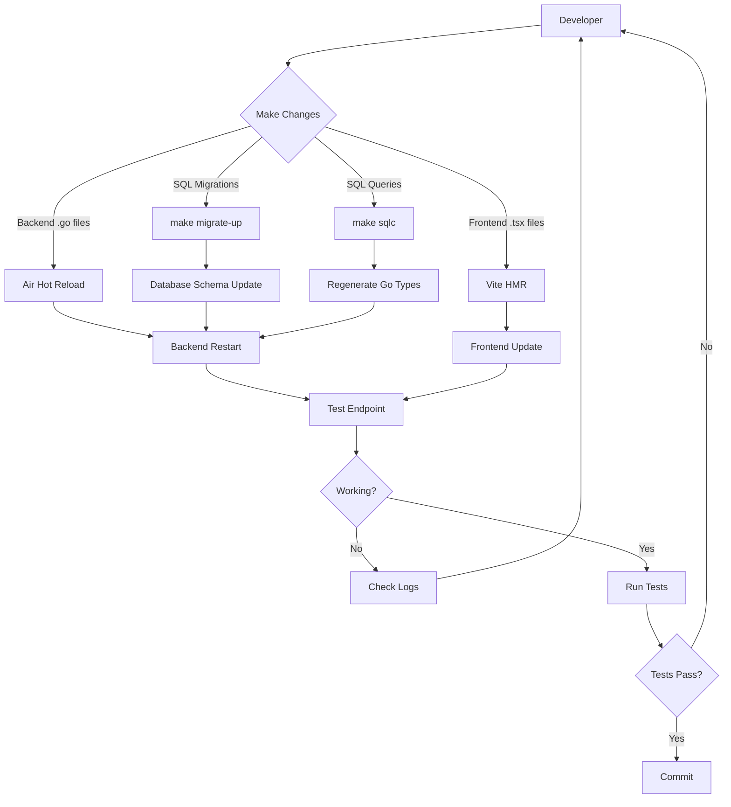

# Project Structure Overview

## Directory Tree

```
miniclass/
├── .env.example              # Environment variable template
├── .gitignore               # Git ignore rules
├── compose.yaml             # Local development services (Docker Compose)
├── README.md                # Main project documentation
├── IMPLEMENTATION_PLAN.md   # Step-by-step development plan
├── achitecture.md           # Architecture decisions
├── AGENTS.md                # Agent configuration
├── WORKFLOW.md              # Workflow documentation
│
├── backend/                 # Go API Server
│   ├── .air.toml           # Hot reload configuration
│   ├── go.mod              # Go dependencies
│   ├── Makefile            # Development commands
│   ├── sqlc.yaml           # sqlc configuration
│   │
│   ├── cmd/                # Application entry points
│   │   ├── api/            # → Main API server
│   │   ├── migrate/        # → Migration runner
│   │   └── seed/           # → Database seeder
│   │
│   ├── internal/           # Private application code
│   │   ├── api/            # → HTTP layer (handlers, routes, middleware)
│   │   ├── auth/           # → Authentication (Supabase JWT verification)
│   │   ├── config/         # → Configuration management
│   │   ├── db/             # → Database layer (sqlc generated + helpers)
│   │   └── domain/         # → Business logic (assignment algorithm)
│   │
│   ├── migrations/         # Database migrations (Goose)
│   │   └── [empty]         # → To be created: 00001_initial_schema.sql
│   │
│   ├── scripts/            # Utility scripts
│   │   ├── init-test-db.sql  # → Creates test database
│   │   └── [todo] seed.sql   # → Sample data for development
│   │
│   ├── sql/                # SQL queries for sqlc
│   │   └── queries/        # → Query definitions (.sql files)
│   │
│   └── tests/              # Test suites
│       └── integration/    # → Integration tests
│
└── frontend/               # React Application
    ├── .eslintrc.cjs      # ESLint configuration
    ├── package.json       # Node dependencies & scripts
    ├── tsconfig.json      # TypeScript configuration
    ├── tsconfig.node.json # TypeScript config for Vite
    ├── vite.config.ts     # Vite build configuration
    │
    ├── public/            # Static assets
    │   └── [empty]        # → favicon, images, etc.
    │
    └── src/               # Application source
        ├── main.tsx       # → App entry point
        ├── App.tsx        # → Root component
        │
        ├── components/    # Shared UI components
        │   └── [empty]    # → Button, Card, Layout, etc.
        │
        ├── features/      # Feature modules
        │   ├── auth/      # → Login, logout, auth state
        │   ├── classes/   # → Class management
        │   ├── students/  # → Student management
        │   └── assignments/ # → Assignment creation/drag-drop
        │
        ├── hooks/         # Custom React hooks
        │   └── [empty]    # → useAuth, useApi, etc.
        │
        └── lib/           # Utilities & configuration
            └── [empty]    # → API client, types, helpers
```

---

## Data Flow Architecture

```
┌─────────────────────────────────────────────────────────┐
│                      Browser (User)                      │
└────────────────────────┬────────────────────────────────┘
                         │
                         ▼
┌─────────────────────────────────────────────────────────┐
│              Frontend (React + TypeScript)               │
│                                                          │
│  • Vite Dev Server (port 5173)                          │
│  • TanStack Query for server state                      │
│  • dnd-kit for drag & drop                              │
│  • React Router for navigation                          │
└────────────────────────┬────────────────────────────────┘
                         │
                         │ HTTP/JSON
                         │ GET /api/health
                         │ POST /api/assignments
                         │ etc.
                         ▼
┌─────────────────────────────────────────────────────────┐
│                Backend (Go + Chi)                        │
│                                                          │
│  • HTTP Server (port 8080)                              │
│  • Chi Router + Middleware                              │
│  • JWT verification (Supabase)                          │
│  • Business logic (assignment algorithm)                │
└────────────────────────┬────────────────────────────────┘
                         │
                         │ pgx + sqlc
                         │ Type-safe queries
                         ▼
┌─────────────────────────────────────────────────────────┐
│            Database (PostgreSQL)                         │
│                                                          │
│  • Local: Docker container (port 5432)                  │
│  • Production: Supabase managed Postgres                │
│  • Migrations: Goose                                    │
└─────────────────────────────────────────────────────────┘
```

---

## Development Workflow



---

## Key Technologies by Layer

### Frontend
- **Framework:** React 18 with TypeScript
- **Build Tool:** Vite 5
- **State Management:** TanStack Query (server state)
- **Routing:** React Router v6
- **Drag & Drop:** dnd-kit (to be added)
- **UI Components:** shadcn/ui (to be added)
- **Testing:** Vitest

### Backend
- **Language:** Go 1.26 (1.27+ recommended when available)
- **HTTP Framework:** Chi v5
- **Database Driver:** pgx/v5
- **Query Builder:** sqlc (type-safe SQL)
- **Migrations:** Goose v3
- **Hot Reload:** Air
- **Testing:** Go testing + testify

### Database
- **Engine:** PostgreSQL 18
- **Local:** Docker container
- **Production:** Supabase managed
- **GUI:** Adminer (port 8081)

### Infrastructure
- **Containerization:** Docker Compose
- **Environment:** .env files
- **CI/CD:** GitHub → Render (planned)

---

## Configuration Files

| File | Purpose |
|------|---------|
| `.env.example` | Template for environment variables |
| `.env` | Local environment (gitignored) |
| `compose.yaml` | Local services (Postgres, Adminer) |
| `backend/go.mod` | Go dependencies |
| `backend/Makefile` | Backend development commands |
| `backend/.air.toml` | Hot reload configuration |
| `backend/sqlc.yaml` | SQL to Go code generation |
| `frontend/package.json` | Node dependencies & scripts |
| `frontend/vite.config.ts` | Vite build & dev server config |
| `frontend/tsconfig.json` | TypeScript compiler settings |

---

## Port Allocation

| Service | Default Port | Configurable Via |
|---------|--------------|------------------|
| Frontend (Vite) | 5173 | `VITE_PORT` |
| Backend (Go API) | 8080 | `PORT` |
| PostgreSQL | 5432 | `POSTGRES_PORT` |
| Adminer | 8081 | `ADMINER_PORT` |

All ports are configurable via `.env` to support parallel worktrees.

---

## Make Commands (Backend)

```bash
make help           # Show all commands
make install-tools  # Install air, sqlc, goose
make dev            # Run with hot reload
make build          # Build binary
make migrate-up     # Apply migrations
make migrate-down   # Rollback migration
make migrate-create # Create new migration
make seed           # Load seed data
make reset-db       # Nuclear option: drop/recreate/migrate/seed
make sqlc           # Regenerate Go code from SQL
make test           # Run integration tests
make test-coverage  # Tests with coverage report
```

---

## Bun Scripts (Frontend)

```bash
bun run dev      # Start dev server
bun run build    # Production build
bun run preview  # Preview production build
bun run lint     # Run ESLint
bun run test     # Run Vitest
```

---

## Next Implementation Steps

See `IMPLEMENTATION_PLAN.md` for the detailed step-by-step plan.

**Summary:**
1. ✅ Scaffold complete
2. ⏳ Implement backend config & database connection
3. ⏳ Create first migration
4. ⏳ Build health check endpoint
5. ⏳ Create frontend health check page
6. ⏳ Write integration test
7. ⏳ Verify end-to-end flow

Once complete, move to data modeling and CRUD operations.
